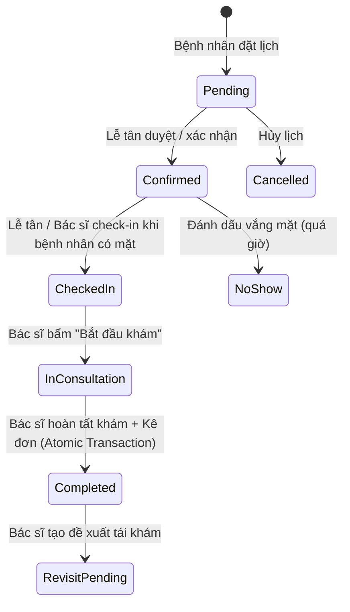

# Doctor Clinical Workspace - Tài liệu Kiến trúc & Hướng dẫn Vận hành

ClinicCare AI cung cấp không gian làm việc lâm sàng toàn diện (**Doctor Clinical Workspace**) dành cho bác sĩ phòng khám và bệnh viện, kết nối xuyên suốt end-to-end theo kiến trúc:
```
Database → Backend Authorization & State Machine → Service → DTO → API → Frontend Type → Accessible UI
```

---

## 1. Tài khoản Demo Bác sĩ

Khi khởi chạy hệ thống ở môi trường `Development`, hệ thống đã cấu hình sẵn 10 bác sĩ chính thức với hồ sơ chuyên khoa, lịch làm việc và các ca hẹn mẫu:

| STT | Bác sĩ | Học hàm / Học vị | Chuyên khoa chính | Email đăng nhập | Mật khẩu |
|:---:|---|---|---|---|---|
| **1** | **BS.CKI Nguyễn Minh Khải** | BS.CKI | **Nội Tổng Quát, Tim Mạch** | `doctor@cliniccare.local` | `Demo@12345` |
| 2 | BS Trần Thu Hà | BS | Sản - Phụ Khoa | `bacsi.02@cliniccare.local` | `Demo@12345` |
| 3 | BS.CKII Lê Hoàng Nam | BS.CKII | Chấn Thương Chỉnh Hình | `bacsi.03@cliniccare.local` | `Demo@12345` |
| 4 | ThS.BS Phạm Văn Hùng | ThS.BS | Tai Mũi Họng | `bacsi.04@cliniccare.local` | `Demo@12345` |
| 5 | BS Đinh Thị Yến | BS | Da Liễu | `bacsi.05@cliniccare.local` | `Demo@12345` |
| 6 | BS.CKI Vũ Quang Vinh | BS.CKI | Thần Kinh | `bacsi.06@cliniccare.local` | `Demo@12345` |
| 7 | TS.BS Bùi Hải Yến | TS.BS | Nội Tiết | `bacsi.07@cliniccare.local` | `Demo@12345` |
| 8 | BS Đỗ Tuấn Anh | BS | Nhãn Khoa | `bacsi.08@cliniccare.local` | `Demo@12345` |
| 9 | BS.CKI Lý Kim Dung | BS.CKI | Nhi Khoa | `bacsi.09@cliniccare.local` | `Demo@12345` |
| 10 | BS Hoàng Văn Đạt | BS | Tiêu Hóa | `bacsi.10@cliniccare.local` | `Demo@12345` |

> [!NOTE]
> Tài khoản bác sĩ mẫu chính là **`doctor@cliniccare.local`** (BS.CKI Nguyễn Minh Khải). Bác sĩ có sẵn lịch trực và danh sách bệnh nhân chờ khám trong ngày.

---

## 2. Luồng Nghiệp vụ Lâm sàng (Clinical State Machine)

Hệ thống tuân thủ nghiêm ngặt máy trạng thái y tế (Medical State Machine), bảo đảm tính toàn vẹn và ngăn chặn các bước nhảy trạng thái trái phép:



### Bảng Quy tắc Chuyển Trạng thái:

| Trạng thái hiện tại | Thao tác | Trạng thái tiếp theo | Điều kiện kiểm tra |
|---|---|---|---|
| `Confirmed` | **Tiếp nhận (Check-in)** | `CheckedIn` | Bệnh nhân có mặt tại phòng khám. |
| `Confirmed` | **Vắng mặt (No-show)** | `NoShow` | Giờ hẹn đã qua giờ hiện tại. |
| `CheckedIn` | **Bắt đầu khám (Start)** | `InConsultation` | Tạo bản ghi `VisitSummary` phiên khám ban đầu. |
| `InConsultation` | **Hoàn tất ca khám** | `Completed` | Yêu cầu bắt buộc có Chẩn đoán (`Diagnosis`) hoặc Kết luận (`Summary`). Chốt đơn thuốc thành `Issued`. |
| `Completed` | **Tạo đề xuất tái khám** | `PendingPatientResponse` | Ngày hẹn tái khám phải sau ngày hiện tại. |

> [!IMPORTANT]
> Bất kỳ thao tác chuyển trạng thái không hợp lệ (ví dụ: cố tình bấm hoàn tất khi chưa bắt đầu khám, hoặc check-in khi lịch đang ở trạng thái `Pending`) sẽ bị Backend chặn với mã lỗi `422 UnprocessableEntity` (`INVALID_STATE_TRANSITION`).

---

## 3. Không gian Làm việc Khám bệnh (Clinical Workspace UI/UX)

Tại đường dẫn `/doctor/examination/:id`, bác sĩ được cung cấp giao diện khám tập trung với 4 tab nghiệp vụ:

### 3.1. Tổng quan & Bối cảnh bệnh nhân (Patient Summary & Context)
- Thông tin hành chính: Mã hồ sơ, Họ tên, Tuổi, Giới tính, Số điện thoại, Địa chỉ.
- Lý do đến khám (`Chief Complaint`).
- Lịch sử tiền sử bệnh và các lần khám trước đó tại phòng khám.

### 3.2. Dấu hiệu sinh tồn (Vital Signs)
- Các chỉ số: Nhiệt độ (°C), Huyết áp tâm thu/tâm trương (mmHg), Mạch (lần/phút), Nhịp thở, SpO2 (%), Cân nặng (kg), Chiều cao (cm).
- **Tính toán BMI tự động thời gian thực** theo chuẩn WHO dành cho người châu Á:
  $$\text{BMI} = \frac{\text{Cân nặng (kg)}}{(\text{Chiều cao (m)})^2}$$
  - $\text{BMI} < 18.5$: Thiếu cân / Gầy (Xanh dương).
  - $18.5 \le \text{BMI} < 23.0$: Bình thường (Xanh lá cây).
  - $23.0 \le \text{BMI} < 25.0$: Tiền béo phì / Thừa cân (Vàng da cam).
  - $25.0 \le \text{BMI} < 30.0$: Béo phì độ I (Đỏ cam).
  - $\text{BMI} \ge 30.0$: Béo phì độ II trở lên (Đỏ đậm).

### 3.3. Diễn tiến & Bệnh án (Clinical Encounter)
- Chẩn đoán chính (`Diagnosis`) và Mã bệnh quốc tế ICD-10 (`DiagnosisCode`).
- Triệu chứng lâm sàng (`ClinicalFindings`).
- Kế hoạch điều trị (`TreatmentPlan`).
- Kết luận & Lời dặn theo dõi (`Summary` & `FollowUpInstruction`).

### 3.4. Kê đơn thuốc điện tử (Prescription Drafting)
- Tìm kiếm thuốc thời gian thực từ danh mục kho thuốc thật của phòng khám.
- Hiển thị số lượng tồn kho khả dụng tức thời (`AvailableStock`).
- Cấu hình chi tiết từng dòng thuốc: Liều dùng, Đường dùng, Số lần/ngày, Số ngày uống, Tổng số lượng, Hướng dẫn sử dụng.
- Lưu nháp đơn thuốc (`Draft`) độc lập hoặc phát hành đơn (`Issued`) đồng bộ cùng ca khám.

---

## 4. Cơ chế Kiểm soát Đồng thời & Bảo vệ Dữ liệu (Concurrency & Privacy)

1. **Kiểm soát đồng thời lạc quan (Optimistic Concurrency Control):**
   - Thực thể `VisitSummary`, `AppointmentVitalSigns`, và `Prescription` được trang bị Concurrency Token `RowVersion` (`byte[]`).
   - Mỗi lần lưu, client gửi `RowVersion` hiện tại. Nếu có phiên làm việc khác đã ghi đè dữ liệu trước đó, hệ thống phản hồi `409 Conflict` kèm thông báo tiếng Việt rõ ràng: *"Dữ liệu đã bị sửa đổi bởi phiên làm việc khác. Vui lòng tải lại trang."*

2. **Cách ly dữ liệu bác sĩ (Data Privacy & Isolation):**
   - Mọi truy vấn lịch hẹn, hồ sơ bệnh án, dấu hiệu sinh tồn đều được thẩm tra qua `DoctorContextService` dựa trên JWT Claims.
   - Bác sĩ A không thể xem hoặc sửa ca khám của Bác sĩ B. Trường hợp truy cập trái phép sẽ trả về `404 NotFound` hoặc `403 Forbidden`.

3. **Giao dịch nguyên tử (Atomic Database Transaction):**
   - Khi hoàn tất ca khám, việc chuyển trạng thái cuộc hẹn sang `Completed`, lưu `VisitSummary`, cập nhật lịch sử `AppointmentHistory`, và phát hành đơn thuốc `Prescription` sang trạng thái `Issued` được thực thi trong cùng 1 Database Transaction (`Serializable` Isolation Level). Nếu một thao tác thất bại, toàn bộ sẽ được rollback nguyên vẹn.

---

## 5. Lịch Trực & Đăng ký Nghỉ phép (Schedule & Leave Preview)

- **Lịch trực tuần (`/doctor/schedule`):** Xem lưới ca trực hàng tuần, trạng thái các slot khám (trống, đã có người đặt, đã khám xong).
- **Xem trước ảnh hưởng khi xin nghỉ (`/doctor/leaves/preview-impact`):** Khi bác sĩ chọn khoảng thời gian xin nghỉ phép, hệ thống tự động quét và thống kê số lượng cuộc hẹn của bệnh nhân bị ảnh hưởng, hiển thị danh sách chi tiết để bác sĩ và lễ tân chủ động phối hợp dời lịch.
