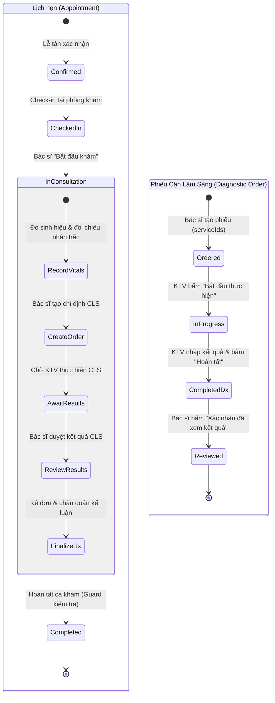

# Doctor Clinical Workspace & Diagnostic Workflow - Tài liệu Kiến trúc & Hướng dẫn Vận hành

ClinicCare AI cung cấp không gian làm việc lâm sàng toàn diện (**Doctor Clinical Workspace**) và phân hệ Cận lâm sàng (**Diagnostic Order & Technician Workflow**) dành cho bác sĩ, kỹ thuật viên và bệnh nhân, kết nối xuyên suốt end-to-end theo kiến trúc:
```
Database (EF Core / SQL Server cho Development & Production, SQLite In-Memory cho Integration Tests) → Backend Authorization & State Machine → Service Layer → DTOs → RESTful APIs → Frontend Types → Accessible UI Components
```

---

## 1. Tài khoản Demo & Phân quyền (RBAC)

Khi khởi chạy hệ thống ở môi trường `Development`, dữ liệu mẫu đã được chuẩn hóa sẵn cho toàn bộ các vai trò:

| STT | Vai trò / Họ tên | Chuyên khoa / Vị trí | Email đăng nhập | Mật khẩu | Phạm vi truy cập |
|:---:|---|---|---|---|---|
| **1** | **BS.CKI Nguyễn Minh Khải** | **Nội Tổng Quát, Tim Mạch** | `doctor@cliniccare.local` | `Demo@12345` | Bàn khám bác sĩ, chỉ định CLS, xem kết quả, hoàn tất khám |
| 2-10 | 9 Bác sĩ chuyên khoa khác | Sản, Chấn thương, Da liễu, Nhi... | `bacsi.02` → `bacsi.10@cliniccare.local` | `Demo@12345` | Bàn khám theo phân công chuyên khoa |
| **11** | **KTV Cận Lâm Sàng** | **Kỹ thuật viên Xét nghiệm & CĐHA** | `technician@cliniccare.local` | `Demo@12345` | `/diagnostics`: Hàng đợi chỉ định, tiếp nhận, nhập kết quả |
| **12** | **Lễ tân Nguyễn Thu Trang** | **Bộ phận Tiếp đón & Lễ tân** | `reception@cliniccare.local` | `Demo@12345` | Tiếp nhận, check-in, phân luồng bệnh nhân |
| **13** | **Bệnh nhân Nguyễn Đình Thành** | **Người bệnh** | `patient@cliniccare.local` | `Demo@12345` | Đặt lịch, xem kết quả CLS & lịch sử sinh hiệu (`/patient/diagnostic-results`) |

---

## 2. Quy trình Nghiệp vụ Lâm sàng & Cận lâm sàng (Clinical & Diagnostic State Machine)

Hệ thống quản lý trạng thái kép giữa **Phiên khám của Bác sĩ (Encounter/Appointment)** và **Phiếu chỉ định Cận lâm sàng (Diagnostic Order)**:



### Điều kiện Ràng buộc Hoàn tất Khám (Consultation Completion Guards):
Hệ thống cài đặt 2 chốt chặn nghiệp vụ nghiêm ngặt trong `DoctorAppointmentService.CompleteAppointmentAsync`:
1. **Chặn khi còn chỉ định đang chờ kết quả (`PENDING_DIAGNOSTIC_RESULTS` - HTTP 422):**
   Nếu ca khám có phiếu CLS ở trạng thái `Ordered` hoặc `InProgress`, bác sĩ KHÔNG THỂ bấm "Hoàn tất ca khám".
2. **Chặn khi có kết quả nhưng bác sĩ chưa duyệt (`UNREVIEWED_DIAGNOSTIC_RESULTS` - HTTP 422):**
   Nếu KTV đã hoàn thành phiếu (`Completed`) nhưng bác sĩ chưa bấm **"Xác nhận đã xem kết quả"** (`ReviewedAtUtc == null`), hệ thống sẽ từ chối hoàn tất ca khám để bảo đảm bác sĩ không bỏ sót dữ liệu chẩn đoán của bệnh nhân.

---

## 3. Theo dõi Sinh hiệu & Nhân trắc học Dọc (Longitudinal Anthropometrics & Vitals)

Tại giao diện khám bệnh `/doctor/appointments/:id/examination`, tab **Dấu hiệu sinh tồn** được thiết kế thành 4 khu vực thông tin trực quan:

### 3.1. Vùng 1: Biểu mẫu nhập số đo hiện tại (Current Measurement Form)
- Huyết áp tâm thu / tâm trương (mmHg), Mạch (bpm), Nhiệt độ (°C), SpO2 (%), Nhịp thở.
- Cân nặng (kg), Chiều cao (cm).
- **Nút "Dùng chiều cao lần trước":** Khi bấm, hệ thống tự động điền chiều cao từ lần đo gần nhất của bệnh nhân, giảm thao tác đo lại cho người trưởng thành.
- **Tính toán chỉ số khối cơ thể (BMI) thời gian thực:**
  $$\text{BMI} = \frac{\text{Cân nặng (kg)}}{(\text{Chiều cao (m)})^2}$$
  Kèm huy hiệu phân loại theo cấu hình hệ thống: <18.5 Thiếu cân (Gầy), <25.0 Bình thường, <30.0 Thừa cân / Tiền béo phì, >=30.0 Béo phì.

### 3.2. Vùng 2: Số liệu lần đo liền trước (Previous Measurement)
- Hiển thị ngày đo gần nhất, người ghi nhận, chiều cao, cân nặng và BMI quá khứ để bác sĩ có điểm tựa so sánh.

### 3.3. Vùng 3: Biến thiên nhân trắc (Anthropometric Deltas)
- **Độ chênh lệch cân nặng ($\Delta \text{Weight}$):** $\text{Weight}_{\text{hiện tại}} - \text{Weight}_{\text{trước}}$ (kg).
- **Độ chênh lệch BMI ($\Delta \text{BMI}$):** $\text{BMI}_{\text{hiện tại}} - \text{BMI}_{\text{trước}}$.
- Mã màu trực quan: Tăng cân (Cam/Đỏ cảnh báo), Giảm cân (Xanh dương), Ổn định (Xanh lá).

### 3.4. Vùng 4: Bảng lịch sử sinh hiệu (Longitudinal Vital History Table)
- Bảng thống kê các lần đo sinh hiệu trước đây của bệnh nhân (thời gian, người đo, các chỉ số HA, mạch, nhiệt độ, SpO2, BMI).

---

## 4. Phân hệ Cận lâm sàng (Diagnostic Services & Workflow)

### 4.1. Danh mục Dịch vụ Cận lâm sàng (Catalog)
Hệ thống khởi tạo sẵn 10 danh mục kỹ thuật y tế chuẩn:
1. `LAB-CBC`: Tổng phân tích tế bào máu ngoại vi (Laboratory)
2. `LAB-GLU`: Định lượng Glucose máu (Laboratory)
3. `LAB-LIPID`: Bộ mỡ máu toàn phần (Laboratory)
4. `LAB-LFT`: Đánh giá chức năng gan AST/ALT (Laboratory)
5. `LAB-RFT`: Đánh giá chức năng thận Ure/Creatinin (Laboratory)
6. `US-ABD`: Siêu âm ổ bụng tổng quát (Ultrasound)
7. `US-THY`: Siêu âm tuyến giáp (Ultrasound)
8. `US-ECHO`: Siêu âm Doppler tim màu (Ultrasound)
9. `IMG-CXR`: Chụp X-quang ngực thẳng (Imaging)
10. `IMG-ECG`: Điện tâm đồ ECG 12 chuyển đạo (Other)

### 4.2. Thao tác của Bác sĩ trong Phiên khám
1. **Tạo chỉ định:** Trong tab *"Chỉ định Cận lâm sàng"*, bác sĩ chọn một hoặc nhiều dịch vụ, nhập chẩn đoán lâm sàng / lý do chỉ định và ghi chú chuẩn bị mẫu.
2. **In phiếu chỉ định (`/doctor/diagnostic-orders/:id/print`):**
   - Phiếu chỉ định chuẩn y tế gồm: Thông tin cơ sở khám chữa bệnh demo, mã phiếu `DX`, mã ca khám, thông tin bệnh nhân, danh sách dịch vụ kèm hướng dẫn nhịn ăn/chuẩn bị, chữ ký kỹ thuật viên và bác sĩ chỉ định.
   - Hỗ trợ in trực tiếp hoặc xuất PDF qua `@media print`.
3. **Theo dõi tiến độ thời gian thực:** Trạng thái phiếu (`Chờ thực hiện` → `Đang thực hiện` → `Đã có kết quả`).
4. **Xem kết quả & Xác nhận:** Khi KTV nhập xong, kết quả hiển thị chi tiết (trị số, đơn vị, khoảng tham chiếu, kết luận của KTV). Bác sĩ bấm **"Xác nhận đã xem kết quả"** để mở khóa cho phép kết thúc buổi khám.

### 4.3. Bàn làm việc Kỹ thuật viên Cận lâm sàng (`/diagnostics`)
- **Dashboard KTV:**
  - Thống kê KPI hôm nay: Chờ thực hiện, Đang thực hiện, Hoàn tất trong ngày.
  - Bộ lọc: Trạng thái, ngày tháng, tìm kiếm bệnh nhân / mã phiếu.
  - Phân luồng công việc: Nhận bệnh nhân (`start`) → Nhập kết quả từng xét nghiệm/siêu âm (`RecordItemResult`) → Hoàn tất phiếu (`complete`).
- **Màn hình Nhập kết quả (`/diagnostics/orders/:id`):**
  - Form nhập liệu cho từng dịch vụ: Trị số kết quả (`ResultText`), Kết luận chuyên môn (`Conclusion`), Khoảng tham chiếu (`ReferenceRange`), Đơn vị đo (`Unit`).
  - Hỗ trợ lưu nháp từng chỉ số trước khi nhấn hoàn tất toàn bộ phiếu.

### 4.4. Cổng thông tin Bệnh nhân (`/patient/diagnostic-results`)
- Người bệnh tự tra cứu lịch sử xét nghiệm và chẩn đoán hình ảnh cá nhân.
- Giao diện dạng Accordion: Mã phiếu, bác sĩ chỉ định, trạng thái duyệt của bác sĩ (`Đã có kết luận bác sĩ`), chi tiết từng xét nghiệm kèm kết luận dễ hiểu.
- Tab chuyển đổi xem biểu đồ/lịch sử các chỉ số sinh hiệu theo thời gian.
- **Bảo mật tuyệt đối:** API áp dụng RBAC xác thực `PatientId`, ngăn chặn bệnh nhân xem kết quả của người khác.

---

## 5. Danh sách API Cận lâm sàng & Sinh hiệu

| Phương thức | Endpoint | Vai trò | Mô tả nghiệp vụ |
|---|---|---|---|
| `GET` | `/api/v1/diagnostic-services` | Doctor, Tech, Admin | Danh mục dịch vụ cận lâm sàng |
| `POST` | `/api/v1/doctor/appointments/{id}/diagnostic-orders` | Doctor | Tạo phiếu chỉ định cận lâm sàng |
| `GET` | `/api/v1/doctor/appointments/{id}/diagnostic-orders` | Doctor | Danh sách phiếu CLS của ca khám |
| `GET` | `/api/v1/doctor/diagnostic-orders/{id}` | Doctor | Chi tiết phiếu chỉ định (dùng để in) |
| `POST` | `/api/v1/doctor/diagnostic-orders/{id}/review` | Doctor | Bác sĩ xác nhận đã xem kết quả CLS |
| `POST` | `/api/v1/doctor/diagnostic-orders/{id}/cancel` | Doctor | Hủy phiếu chỉ định (khi còn `Ordered`) |
| `GET` | `/api/v1/diagnostics/orders` | DiagnosticTechnician | Danh sách hàng đợi CLS (phân trang, lọc) |
| `GET` | `/api/v1/diagnostics/orders/stats` | DiagnosticTechnician | Thống kê số lượng chỉ định theo trạng thái |
| `GET` | `/api/v1/diagnostics/orders/{id}` | DiagnosticTechnician | Chi tiết phiếu CLS cho KTV |
| `POST` | `/api/v1/diagnostics/orders/{id}/start` | DiagnosticTechnician | Tiếp nhận thực hiện phiếu chỉ định |
| `PUT` | `/api/v1/diagnostics/orders/{id}/items/{itemId}/result` | DiagnosticTechnician | Ghi nhận kết quả cho từng dịch vụ |
| `POST` | `/api/v1/diagnostics/orders/{id}/complete` | DiagnosticTechnician | Hoàn tất toàn bộ phiếu chỉ định |
| `GET` | `/api/v1/patients/me/diagnostic-orders` | Patient | Bệnh nhân xem danh sách phiếu CLS của mình |
| `GET` | `/api/v1/patients/me/diagnostic-orders/{id}` | Patient | Bệnh nhân xem chi tiết kết quả phiếu CLS |
| `GET` | `/api/v1/patients/me/vitals` | Patient | Bệnh nhân xem lịch sử các chỉ số sinh hiệu |
| `GET` | `/api/v1/doctor/appointments/{id}/patient-context` | Doctor | Lấy thông tin nhân trắc học & so sánh delta |
| `PUT` | `/api/v1/doctor/appointments/{id}/vitals` | Doctor | Lưu sinh hiệu & cập nhật nhân trắc học |
