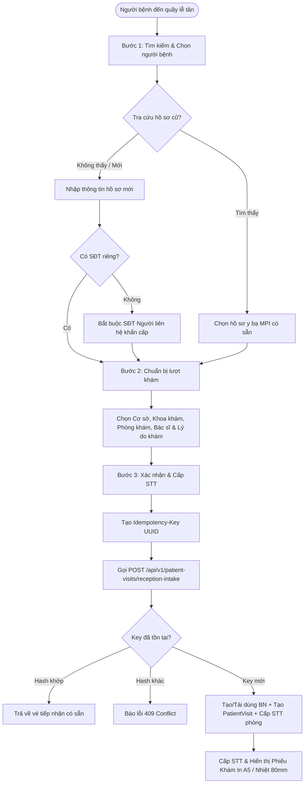
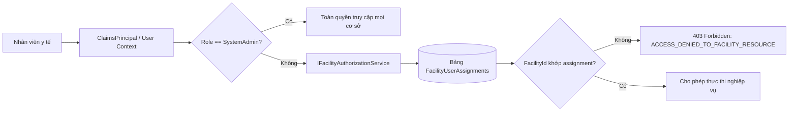

# Kế Hoạch & Thiết Kế Kiến Trúc: Tái Thiết Lập Bàn Làm Việc Lễ Tân & Luồng Khám Chữa Bệnh Ngoại Trú
## Reception Workspace & Connected Outpatient Care Rebuild Plan

---

### 1. Tổng Quan Mục Tiêu & Bối Cảnh (Executive Summary)

Hệ thống quản lý phòng khám và bệnh viện đa cơ sở ClinicCare yêu cầu một nền tảng tiếp đón và điều phối khám ngoại trú chuẩn y tế, khắc phục triệt để các tồn tại của phiên bản tiền nhiệm:
1. **Quy trình tiếp nhận một bước sơ sài**: Thiếu khả năng tra cứu hồ sơ cũ dẫn đến việc trùng lặp hồ sơ bệnh nhân (duplicate MPI profiles), tạo tài khoản ảo không kiểm soát, và thiếu cơ chế bảo vệ trẻ em / người già không có số điện thoại riêng.
2. **Thiếu cơ chế phân quyền theo cơ sở (Facility Scoping)**: Nhân viên tại một cơ sở có thể vô tình xem hoặc thao tác trên dữ liệu cơ sở khác mà không bị chặn ở tầng dịch vụ/dữ liệu.
3. **Phụ thuộc dữ liệu seed tĩnh / giá hardcoded**: Không có giao diện quản trị phân công cơ sở cho nhân viên, quản lý giá dịch vụ cận lâm sàng và giá bán lẻ thuốc theo danh mục thực tế.
4. **Quy trình dược & thu ngân rời rạc**: Cho phép cấp phát thuốc khi chưa thanh toán, hoặc thu tiền làm kết thúc sớm lượt khám khi người bệnh đang chờ cận lâm sàng.
5. **Nguy cơ thu trùng (Double Billing) và lỗi gửi lặp (Non-idempotent Requests)**: Thiếu ràng buộc cơ sở dữ liệu ngăn chặn việc lập trùng hóa đơn cho cùng một chỉ định/đơn thuốc, và rủi ro tạo nhiều lượt khám khi lễ tân click đúp.

Đợt tái thiết lập này mang lại một giải pháp toàn diện từ Backend (.NET 10 Web API + EF Core + SQL Server) đến Frontend (React 19 + TypeScript + Vite) đáp ứng tiêu chuẩn vận hành bệnh viện thông minh.

---

### 2. Mô Hình Dữ Liệu & Ràng Buộc Thực Thể (Entity Architecture)

#### 2.1. Quản lý Định danh Người Bệnh Bền Vững (Stable Patient Identity)
- **`Patient.UserId` là Nullable (`long?`)**: Người bệnh vãng lai (walk-in) hoặc người đăng ký tại quầy không bắt buộc phải có tài khoản cổng thông tin (`AppUser`). Tuyệt đối không tạo tài khoản ảo (shadow accounts) gây rác dữ liệu authentication.
- **Mã Bệnh Án Vĩnh Viễn (`MedicalRecordNumber` - MRN)**: Cấp phát duy nhất định dạng `BN-YYYY-XXXXXX` (VD: `BN-2026-000001`), gắn liền với định danh CCCD/CMND và số điện thoại.
- **Quy tắc Số Điện Thoại Dự Phòng**: Khi tiếp nhận trẻ em, người cao tuổi không có số điện thoại cá nhân, hệ thống cho phép bỏ trống số điện thoại bệnh nhân nhưng bắt buộc phải có thông tin Người liên hệ khẩn cấp (`EmergencyContact.PhoneNumber`).

#### 2.2. Hồ Sơ Idempotency Cơ Sở Dữ Liệu (`IdempotencyRecord`)
Bảo vệ các thao tác ghi nhạy cảm (Tiếp nhận khám, Thanh toán viện phí):
```csharp
public class IdempotencyRecord
{
    public long Id { get; set; }
    public string Key { get; set; } = string.Empty;              // Unique key từ client (UUID)
    public string Operation { get; set; } = string.Empty;        // E.g. "ReceptionIntake"
    public string RequestPayloadHash { get; set; } = string.Empty; // SHA-256 hash của request body
    public string ResponsePayload { get; set; } = string.Empty;  // JSON serialization kết quả
    public DateTime CreatedAtUtc { get; set; }
    public DateTime ExpiresAtUtc { get; set; }                   // TTL (mặc định 24h)
}
```
- Khi nhận cùng `Idempotency-Key` với hash payload khớp: Trả về kết quả đã lưu ngay lập tức, không tạo bản ghi mới.
- Khi nhận cùng `Idempotency-Key` với hash payload khác: Ném ngoại lệ `InvalidOperationException("IDEMPOTENCY_KEY_REUSED_WITH_DIFFERENT_PAYLOAD")` tương ứng HTTP 409 Conflict.

#### 2.3. Chống Thu Trùng Phí Cận Lâm Sàng & Đơn Thuốc (Anti-Double-Billing Index)
- Đặt Filtered Unique Index trên bảng `Invoices`:
  ```sql
  CREATE UNIQUE INDEX IX_Invoices_ReferenceType_ReferenceId_Active
  ON Invoices (ReferenceType, ReferenceId)
  WHERE IsCancelled = 0;
  ```
- Cơ chế khóa hóa đơn chưa thanh toán (`PENDING_INVOICE_EXISTS`): Một lượt khám không thể xuất hóa đơn bổ sung nếu hóa đơn trước đó trên cùng lượt khám vẫn ở trạng thái `Pending`.
- Khóa chặn kết thúc sớm lượt khám: `BillingService.ProcessPaymentAsync` chỉ chuyển trạng thái lượt khám sang `Completed` khi người bệnh ở trạng thái `InBilling` hoặc `ConsultationCompleted`. Các thanh toán tạm thời cho chỉ định cận lâm sàng giữ nguyên trạng thái `WaitingForDiagnostics`.

---

### 3. Quy Trình Tiếp Nhận Khám Ngoại Trú 3 Bước (3-Step Reception Intake)



#### Bước 1: Tra cứu & Quản lý Danh tính (Lookup-First Identity)
- Tìm kiếm nhanh đa năng: Hỗ trợ tìm qua Số Bệnh Án (MRN), Số CCCD/CMND, Số điện thoại hoặc Họ tên.
- Hiển thị chi tiết thông tin thẻ BHYT, tiền sử dị ứng đã ghi nhận trong y bạ.
- Chuyển tab linh hoạt sang "Đăng ký hồ sơ người bệnh mới" với đầy đủ trường dữ liệu chuẩn Bộ Y Tế.

#### Bước 2: Chuẩn bị Lượt khám (Clinical Routing)
- Phân luồng theo Cơ sở (`FacilityId`) và Khoa phòng (`DepartmentId`).
- Tự động lọc buồng khám khả dụng (`RoomId`) và Bác sĩ đang trực tại phòng (`DoctorId`).
- Phân loại mức độ ưu tiên: `Normal` (Thường), `Urgent` (Ưu tiên), `Emergency` (Cấp cứu).
- Ghi nhận lý do đến khám / triệu chứng ban đầu (Chief Complaint) để phục vụ phân luồng khám.

#### Bước 3: Xác nhận & In Phiếu Tiếp Nhận (Ticket Issuance)
- Tổng hợp toàn bộ thông tin hành chính và lâm sàng để lễ tân và người bệnh rà soát.
- Client sinh mã định danh duy nhất `Idempotency-Key` (UUIDv4) gửi trong header HTTP.
- Server cấp Số Thứ Tự (STT) theo buồng khám trong ngày và trả về `CheckInTicketDto`.
- Cửa sổ xem trước và in phiếu khám định dạng chuẩn A5 hoặc giấy in nhiệt 80mm (POS Thermal).

---

### 4. Kiến Trúc Bảo Mật Phân Quyền Theo Cơ Sở (Record-Level Facility Scoping)



- **Dịch vụ Kiểm soát**: `IFacilityAuthorizationService` với phương thức `AuthorizeFacilityAccessAsync(ClaimsPrincipal user, long facilityId)` và `GetAuthorizedFacilityIdsAsync(ClaimsPrincipal user)`.
- **Ràng buộc Thực thi**: Tất cả các thao tác tiếp nhận khám, tra cứu hàng đợi, lập hóa đơn, phân bổ kho dược đều kiểm tra sự tương thích giữa cơ sở của bản ghi và danh sách cơ sở nhân viên được gán trực.
- **Phản hồi Chuẩn hóa**: Truy cập sai cơ sở lập tức trả về mã lỗi HTTP 403 với nội dung `ACCESS_DENIED_TO_FACILITY_RESOURCE`.

---

### 5. Chu Trình Dược & Thu Ngân (Pharmacy & Cashier Safety Lifecycle)

1. **Bác sĩ kê đơn**: Đơn thuốc tạo ở trạng thái `Prescribed`.
2. **Bệnh nhân xác nhận mua tại quầy dược**: Dược sĩ gọi `ConfirmPurchaseAsync`:
   - Kiểm tra tồn kho khả dụng và trừ kho tức thì (`Stock Reservation`).
   - Đổi trạng thái đơn thuốc sang `InBilling`.
3. **Thanh toán tại Thu ngân**: Lễ tân/Thu ngân lập hóa đơn loại `Prescription` và xác nhận thu tiền:
   - Hóa đơn chuyển trạng thái `Paid`.
4. **Cấp phát thuốc tại Nhà thuốc**:
   - Dược sĩ gọi `DispensePrescriptionAsync`.
   - **Chốt chặn an toàn**: Hệ thống kiểm tra hóa đơn thanh toán tương ứng. Nếu đơn chưa có hóa đơn hoặc hóa đơn chưa thanh toán, chặn thao tác với mã lỗi `PRESCRIPTION_NOT_PAID`.
   - Khi đã xác nhận thanh toán, hoàn tất cấp phát (`Dispensed`).

---

### 6. Giao Diện Cấu Hình Quản Trị Thực Tế (Administrative Configuration UIs)

Loại bỏ hoàn toàn các giá trị mẫu (mock/seed) bằng 3 giao diện quản trị cơ sở:
1. **Phân công Nhân sự theo Cơ sở (`AdminFacilities.tsx`)**:
   - Giao diện trực quan xem danh sách nhân sự tại từng cơ sở.
   - Thêm/Xóa phân công nhân viên y tế vào cơ sở làm việc thực tế (`POST /api/v1/facilities/{id}/assignments`, `DELETE /api/v1/facilities/{id}/assignments/{assignmentId}`).
2. **Bảng giá Dịch vụ Cận Lâm Sàng (`AdminBilling.tsx`)**:
   - Tab "Bảng giá Cận lâm sàng" cho phép xem danh mục X-quang, Siêu âm, Xét nghiệm máu...
   - Cập nhật đơn giá trực tiếp (`PUT /api/v1/diagnostic-services/{id}/price`), đồng bộ ngay lập tức vào module chỉ định bác sĩ và thu ngân viện phí.
3. **Bảng giá Thuốc Danh mục Bệnh viện (`AdminMedicines.tsx`)**:
   - Cập nhật đơn giá bán lẻ thuốc (`PUT /api/v1/medicines/{id}/price`).
   - Tự động phản ánh vào công thức tính tiền hóa đơn đơn thuốc ngoại trú.
