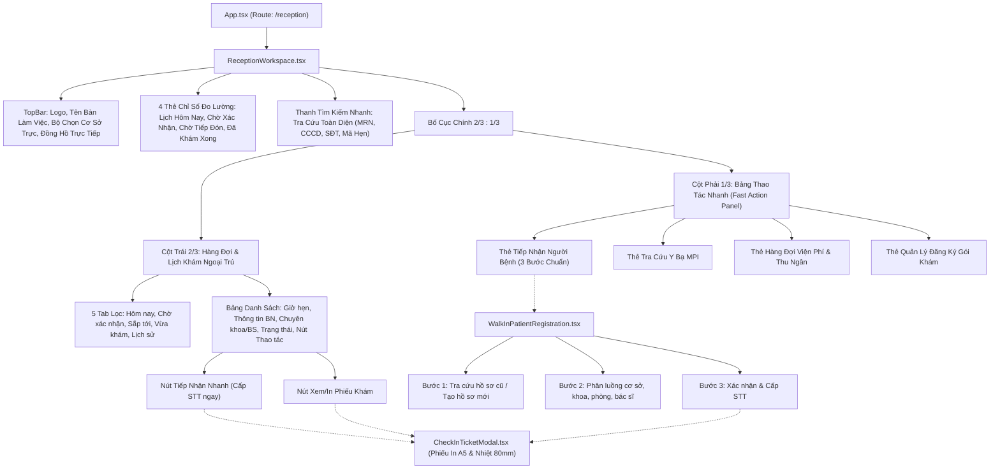

# Hướng Dẫn Vận Hành & Kiến Trúc Trực Quan: Bàn Làm Việc Lễ Tân & Quy Trình Khám Ngoại Trú
## Reception Workspace & Outpatient Care Visual Walkthrough

---

### 1. Giới Thiệu Chung (Introduction)

Phân hệ Tiếp nhận & Lễ tân (Reception Workspace) đóng vai trò cửa ngõ vận hành của toàn bộ quy trình khám chữa bệnh ngoại trú tại ClinicCare. Đợt tái thiết lập này mang lại một môi trường làm việc chuẩn bệnh viện hiện đại, tích hợp sâu với cơ sở dữ liệu định danh người bệnh MPI, cơ chế phân luồng đa cơ sở, kiểm soát viện phí chặt chẽ và an toàn chu trình cấp phát dược.

---

### 2. Sơ Đồ Cấu Trúc Thành Phần Giao Diện (Component Hierarchy)

---

### 3. Chi Tiết Các Màn Hình & Trải Nghiệm Người Dùng (Walkthrough Flows)

#### 3.1. Bàn Làm Việc Lễ Tân Trung Tâm (`/reception`)
- **Bộ Chọn Cơ Sở Trực (Facility Switcher)**: Cho phép lễ tân chuyển đổi giữa các cơ sở y tế mà nhân viên được phân công quyền trực. Hệ thống tự động lọc toàn bộ thống kê và danh sách lịch hẹn tương ứng.
- **Đồng Hồ Trực Tiếp (Live Clock)**: Cập nhật thời gian thực từng giây (`Thứ Hai, 14/09/2026 • 09:45:00`), phục vụ đối chiếu giờ hẹn và thời điểm tiếp đón.
- **4 Thẻ Chỉ Số Đo Lường (KPI Cards)**:
  1. *Lịch khám hôm nay*: Tổng số lượt hẹn trong ngày.
  2. *Chờ xác nhận*: Số lịch hẹn bệnh nhân đặt qua ứng dụng/cổng thông tin cần lễ tân xác nhận.
  3. *Chờ tiếp đón / Đang khám*: Bệnh nhân đã xác nhận, sẵn sàng vào quầy nhận STT hoặc đang khám.
  4. *Đã khám xong hôm nay*: Số lượt khám đã hoàn tất chu trình ngoại trú.
- **Bảng Hàng Đợi Ưu Tiên Hành Động (Actionable-First Table)**:
  - Tự động đẩy các lịch hẹn trạng thái `Confirmed` và `Pending` lên đầu danh sách.
  - Cung cấp nút **"Tiếp nhận"** một chạm: Tự động tạo `PatientVisit`, cấp STT phòng khám và mở ngay modal in phiếu khám.

#### 3.2. Quy Trình Tiếp Nhận Người Bệnh 3 Bước (`/reception/walk-in`)
- **Bước 1: Tìm kiếm & Chọn người bệnh (Lookup-First)**:
  - *Chế độ A (Tra cứu)*: Nhập MRN, CCCD, SĐT để tìm hồ sơ cũ trong cơ sở dữ liệu MPI toàn viện. Khi chọn hồ sơ, toàn bộ tiền sử dị ứng, thông tin bảo hiểm được nạp tức thì.
  - *Chế độ B (Tạo mới)*: Form nhập chuẩn Bộ Y tế. Áp dụng quy tắc dự phòng liên lạc khẩn cấp (Emergency Contact Phone Fallback) cho trẻ em, người cao tuổi. Bản ghi tạo ra có `UserId == null`, tuyệt đối không tạo tài khoản ảo.
- **Bước 2: Chuẩn bị lượt khám (Clinical Routing)**:
  - Chọn Cơ sở tiếp nhận, Khoa phòng khám chuyên khoa, Buồng khám cụ thể và Bác sĩ khám.
  - Phân loại mức độ ưu tiên (`Thường`, `Ưu tiên`, `Cấp cứu`) và ghi nhận lý do khám.
- **Bước 3: Xác nhận & Cấp STT**:
  - Tóm tắt trực quan phiếu tiếp nhận. Client sinh `Idempotency-Key` (UUIDv4) gửi kèm header.
  - Máy chủ cấp STT nguyên tử theo buồng khám trong ngày và trả về phiếu khám.

#### 3.3. Modal Phiếu Khám In Chuẩn Y Tế (`CheckInTicketModal`)
- **Khổ Giấy A5 Chuẩn Bệnh Viện**: Đầy đủ thông tin đơn vị y tế, họ tên, mã bệnh án (MRN), mã vạch Barcode Code128, mã QR lượt khám để quét tại cửa buồng khám, phòng khám và bác sĩ tiếp nhận.
- **Khổ Giấy In Nhiệt 80mm (POS Thermal)**: Định dạng nhỏ gọn cho máy in bill nhiệt tại quầy lễ tân với cỡ số thứ tự to rõ ràng, hướng dẫn di chuyển tới buồng khám.

#### 3.4. Các Màn Hình Cấu Hình Quản Trị Hệ Thống
1. **Phân Công Nhân Sự Theo Cơ Sở (`/admin/facilities`)**: Tab phân công nhân viên y tế vào cơ sở làm việc thực tế, loại bỏ việc truy cập chéo cơ sở.
2. **Quản Lý Bảng Giá Cận Lâm Sàng (`/admin/billing`)**: Tab "Bảng giá Cận lâm sàng" cập nhật đơn giá dịch vụ xét nghiệm, chẩn đoán hình ảnh.
3. **Quản Lý Đơn Giá Bán Lẻ Thuốc (`/admin/medicines`)**: Cập nhật giá bán lẻ thuốc theo danh mục thực tế.
4. **Hàng Đợi Thu Ngân Viện Phí (`/reception/billing`)**: Hiển thị lượt khám chưa thu tiền (`Unbilled Visits`), lập hóa đơn và thu tiền chống thu trùng.

---

### 4. Báo Cáo Kiểm Tra & Thẩm Định Chất Lượng (Verification Results)

#### 4.1. Kiểm Thử Tích Hợp Backend (.NET 10 Integration Tests)
- **Tổng số ca kiểm thử**: 216 tests
- **Tỷ lệ vượt qua**: **100% PASS** (216/216 passed)
- **Suite chuyên biệt `ReceptionWorkspaceRebuildTests.cs`**: 13/13 PASS
  - Kiểm tra Idempotency cùng key cùng payload / khác payload.
  - Tiếp nhận người bệnh có sẵn và tái sử dụng MRN.
  - Tiếp nhận người bệnh không có SĐT cá nhân bằng SĐT liên hệ khẩn cấp.
  - Ràng buộc bắt buộc chọn cơ sở `FACILITY_REQUIRED`.
  - Phân quyền theo cơ sở trả về HTTP 403 `ACCESS_DENIED_TO_FACILITY_RESOURCE`.
  - Quản trị cấu hình nhân sự, giá cận lâm sàng, giá thuốc.
  - Khóa giữ tồn kho và chặn cấp phát thuốc khi chưa nộp tiền `PRESCRIPTION_NOT_PAID`.
  - Chống thu trùng hóa đơn và bảo toàn lượt khám chờ cận lâm sàng.

#### 4.2. Kiểm Thử Đơn Vị Frontend (Vitest Suite)
- **Tổng số file kiểm thử**: 19 test files
- **Tổng số ca kiểm thử**: 118 unit tests
- **Tỷ lệ vượt qua**: **100% PASS** (118/118 passed)
- **Suite chuyên biệt `receptionWorkspaceRebuild.test.tsx`**: 3/3 PASS

#### 4.3. Đóng Gói Ứng Dụng Sản Xuất (Vite Production Build)
- Lệnh thực thi: `npm run build` (`tsc -b && vite build`)
- Kết quả: **0 lỗi TypeScript, 0 lỗi biên dịch**, tạo bundle tối ưu trong thư mục `dist/`.
