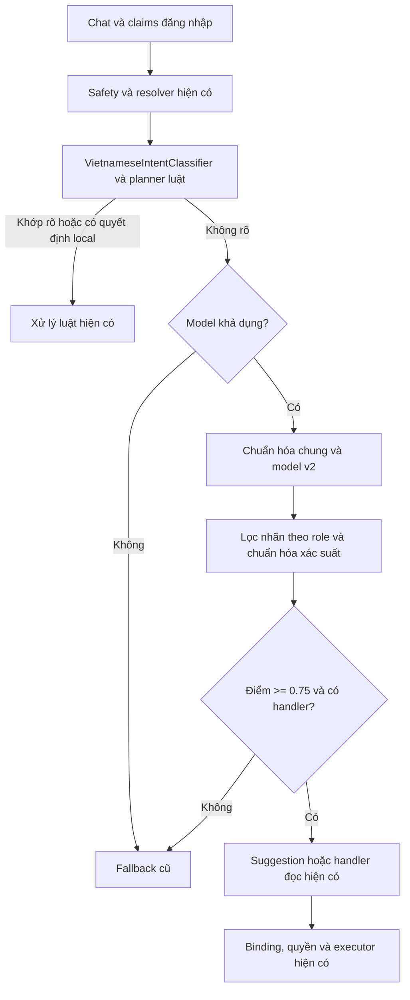

# Dữ liệu intent theo vai trò v1

194 câu hạt giống do AI Claude sinh; tác giả dự án đã duyệt và sửa 9 dòng có `nguon=claude_v1_sua`. SHA256 của TSV được ghim trong test; bản sao giữ nguyên byte nguồn. Đây không phải tập blind test.

## Nhãn, vai trò và tool

`Chung` trong hạt giống và bản ghi sinh đại diện cho cả 6 vai trò; các mã khác được đổi sang tên vai trò tiếng Anh trong đầu ra. `targetTool=null` không gọi tool. StartBooking dùng nút gợi ý `patient.start_booking` để mở booking wizard.

| Nhãn | Vai trò | Tool |
|---|---|---|
| Greeting | Cả 6 vai trò | null |
| Help | Cả 6 vai trò | null |
| ClinicKnowledge | Cả 6 vai trò | clinic.search_knowledge |
| ActionRequest | Cả 6 vai trò | null |
| OutOfScope | Cả 6 vai trò | null |
| StartBooking | Patient | null |
| MyAppointments | Patient | patient.get_my_appointments |
| MyVisits | Patient | patient.get_my_visits |
| MyDiagnosticResults | Patient | patient.get_my_diagnostic_results |
| MyPrescriptions | Patient | patient.get_my_prescriptions |
| MyBills | Patient | patient.get_my_bills |
| TodayAppointments | Receptionist | reception.get_today_appointments |
| ReceptionQueue | Receptionist | reception.get_queue |
| LookupAppointment | Receptionist | reception.lookup_appointment |
| DoctorQueue | Doctor | doctor.get_my_queue |
| PatientSummary | Doctor | doctor.get_patient_summary |
| DiagnosticOrders | Doctor | doctor.get_diagnostic_orders |
| PrescriptionStatus | Doctor | doctor.get_prescription_status |
| TechnicianWorklist | DiagnosticTechnician | technician.get_worklist |
| PrescriptionQueue | Pharmacist | pharmacist.get_prescription_queue |
| InventoryStatus | Pharmacist | pharmacist.get_inventory_status |
| PrescriptionPayment | Pharmacist | pharmacist.get_prescription_payment_status |
| DashboardMetrics | Admin | admin.get_dashboard_metrics |
| AiHealth | Admin | admin.get_ai_health |

## Sinh và chia tập

Bộ sinh dùng `new Random(20261002)`, duyệt theo thứ tự TSV, đánh `seedId=RI-<label>-<thứ tự 2 chữ số trong nhãn>`, không dùng thời gian hay Guid. Ứng viên theo thứ tự: gốc; bỏ dấu (đ→d); chữ thường và bỏ `? . !` ở cuối; viết tắt; một lỗi gõ; một tiền/hậu tố; bỏ dấu rồi viết tắt; bỏ dấu rồi lỗi gõ; bỏ dấu rồi tiền/hậu tố.

Từ điển cố định áp theo ranh giới từ cho cả dạng có/không dấu: không→ko hoặc k (lần lượt hai ứng viên nếu có từ đó), được→dc, bệnh nhân→bn, danh sách→ds, số lượng→sl, xét nghiệm→xn, kết quả→kq, gì→j, rồi→r, vậy→v, với→vs. Mỗi ứng viên viết tắt thay mọi mục hiện diện. Lỗi gõ chọn một từ dài ít nhất 4 ký tự bằng RNG rồi đảo hai ký tự liền nhau, mất hoặc lặp một ký tự; không sửa mã LH. Nếu không có từ đủ dài, ứng viên không đổi và sẽ bị loại trùng.

Mỗi phép tiền/hậu tố chọn đúng một mục bằng RNG trong tiền tố `cho hỏi `, `cho mình hỏi `, `ơi ` hoặc hậu tố ` ạ`, ` nhé`, ` với`, ` giúp mình`. Greeting và OutOfScope bỏ qua phép này. LookupAppointment giữ mã gốc ở bản gốc; các ứng viên khác dùng số ngẫu nhiên 3–5 chữ số và dạng LH-1234 / LH1234 / lh 1234.

Loại trùng chính xác, giữ tối đa 12 ứng viên đầu tiên. Chuẩn hóa so trùng: chữ thường, bỏ dấu, bỏ dấu câu, gộp khoảng trắng. Hai câu gốc trùng giữa nhãn làm bộ sinh dừng trước khi ghi đầu ra; mọi câu gốc được giữ chỗ trước để biến thể không chiếm câu gốc của nhãn khác. Biến thể trùng nhãn khác bị bỏ và đếm trong manifest. Dạng chuẩn hóa trùng trong cùng nhãn được phép.

Sau khi sinh biến thể, xáo Fisher–Yates các câu gốc trong từng nhãn bằng cùng RNG; đúng 2 câu gốc đầu vào validation, còn lại vào train. Tất cả biến thể đi theo seedId. Hai JSON dữ liệu và manifest dùng UTF-8 không BOM, LF, thụt lề 2 và thứ tự ổn định. Manifest ghi SHA256 byte của seeds, labels, train, validation; số lượng theo nhãn/tập; tổng; số ứng viên bỏ do trùng nhãn khác và provenance.

## Sinh lại

Chạy từ gốc repo (cũng tìm được thư mục data mặc định từ thư mục con):

```powershell
dotnet run --project src/tools/ClinicManagement.AI.Training/ClinicManagement.AI.Training.csproj --configuration Release -- --gen-role-intent
```

Để dùng thư mục khác có sẵn cả hai file seeds/labels:

```powershell
dotnet run --project src/tools/ClinicManagement.AI.Training/ClinicManagement.AI.Training.csproj --configuration Release -- --gen-role-intent --data-dir C:\duong-dan\data
```

Lệnh chỉ sinh dữ liệu, không train model hoặc gọi Gemini. `RoleIntentDatasetTests` kiểm tra hash/nhãn/vai trò, tái sinh byte, chia tập, trùng giữa nhãn, mã LH, giới hạn biến thể và không trùng `inputVi` trong phase5_blind_holdout.json.

## Giới hạn

Chưa có tập blind độc lập do người viết cho 24 nhãn này. Các biến thể vẫn có chung nguồn câu gốc; tập validation chỉ đo trên các câu gốc được tách ra. Dữ liệu sinh không thay thế câu thật từ người dùng và không chứng minh chất lượng mô hình.

## Tập đánh giá bổ sung (do AI viết)

`role_intent_eval_ai_v1.tsv` gồm 240 câu, 24 nhãn × 10 câu, do AI Claude viết một lần ngày 2026-10-02; không có người viết tay. Đây KHÔNG phải tập blind độc lập. Chỉ dùng tập này để đo, không dùng để train hay chọn mô hình. Manifest ghi số dòng từng nhãn, kích thước byte và nguồn gốc.

File được khóa bằng SHA-256 `4104b49e57d2f82758602faa63c255cdddf5a6ec2e895d045c27e04382dd4686`; không sửa sau khi commit. Test dùng đúng hàm chuẩn hóa của bộ sinh để kiểm tra không trùng seeds/train/validation hoặc tập blind đã có. Chưa có tập do người viết; cùng nguồn AI với hạt giống nên kết quả đo có thể lạc quan, không chứng minh chất lượng mô hình.

## Thí nghiệm ML.NET role-intent offline v1

Model này chỉ nằm trong tool training, chưa nối classifier runtime/API và không gọi Gemini/LLM live. Microsoft.ML 4.0.3 đã có sẵn, target net10.0. Artifact riêng ở `src/tools/ClinicManagement.AI.Training/models/role-intent-v1/`: `role_intent_model_v1.zip`, `role_intent_model_meta_v1.json`, `role_intent_eval_report_v1.json`. Các model/metadata production và dữ liệu cũ giữ nguyên.

### Lệnh và quy trình chốt

Hai lệnh nhận `--data-dir` và `--out-dir`; mặc định dùng data của tool và thư mục artifact riêng ở trên:

```powershell
dotnet run --project src/tools/ClinicManagement.AI.Training/ClinicManagement.AI.Training.csproj --configuration Release -- --train-role-intent --data-dir C:\duong-dan\data --out-dir C:\duong-dan\thi-nghiem-chua-do
dotnet run --project src/tools/ClinicManagement.AI.Training/ClinicManagement.AI.Training.csproj --configuration Release -- --eval-role-intent --data-dir C:\duong-dan\data --out-dir C:\duong-dan\thi-nghiem-chua-do
```

Train chỉ đọc train/validation/labels, thử trọng số lớp và chọn ngưỡng bằng validation. Trước lần eval đầu tiên, chạy train hai lần với cùng đầu vào để kiểm tra metadata byte và SHA-256 xác suất validation giống nhau. Eval nạp model đã lưu, kiểm tra checksum đầu vào đã chốt và eval, rồi tạo report bằng `FileMode.CreateNew` trước khi đọc/scoring eval. Khi report tồn tại, cả train và eval đều dừng; không xóa report để train hoặc đo lại. Artifact v1 trong repo đã được đo một lần, nên hai lệnh mặc định sẽ bảo vệ thí nghiệm đã chốt. Không dùng eval để quyết định cấu hình hay ngưỡng, kể cả trong một thư mục đầu ra khác.

Pipeline dùng lại đúng `RoleIntentDatasetGenerator.Normalize`, word n-gram 1–2 và ba bộ char n-gram riêng 2, 3, 4 (không có char unigram), ghép và chuẩn hóa L2. L-BFGS maximum entropy dùng seed 20261002, một luồng, tối đa 100 iteration; các option khác theo mặc định Microsoft.ML 4.0.3. Trọng số lớp là `N / (24 * số_mẫu_lớp)`. Score được chuẩn hóa toàn bộ nhãn hoặc mask theo catalog vai trò rồi chuẩn hóa lại; role không biết bị từ chối, `Chung` là hợp của sáu role. Dưới ngưỡng trả `không chắc`; tool không thực thi fallback luật. Caller runtime trong tương lai cần xử lý fallback, nhưng PR này chưa có tích hợp đó.

Phép toán SIMD đã cho sai khác nhỏ về trọng số/xác suất và hash trong kiểm tra lặp. Hai lệnh role-intent tự chạy lại trong tiến trình scalar với `DOTNET_EnableHWIntrinsic=0`, `DOTNET_TieredCompilation=0`; test host dùng `role-intent.runsettings` tương ứng. Project tool/test cũng tắt JIT phân tầng; project API không đổi. Thiết lập JIT theo [tài liệu .NET](https://learn.microsoft.com/en-us/dotnet/core/runtime-config/compilation). Tái lập byte được kiểm trên cùng Windows/.NET/ML.NET; chưa khẳng định hash giống giữa hệ điều hành hoặc CPU khác.

### Cấu hình thử trên validation

Các thử nghiệm SDCA ban đầu cũng chỉ đọc train/validation. Chúng bị loại vì không lặp lại đúng artifact/xác suất qua các tiến trình, dù top-1 và metric ổn định. Không có cấu hình SDCA nào được đo trên eval. Hai cấu hình L-BFGS đáp ứng kiểm tra tái lập được chọn bằng macro-F1 top-1 sau lọc vai trò; tie chọn không trọng số. Metadata ghi đầy đủ hai trial L-BFGS và mọi trial ngưỡng.

| Cấu hình | Accuracy không lọc | Macro-F1 không lọc | Accuracy lọc role | Macro-F1 lọc role | Quyết định |
|---|---:|---:|---:|---:|---|
| SDCA không trọng số, thử ban đầu | 49.12% | 0.4325 | 67.49% | 0.6305 | Loại: tái lập byte thất bại |
| SDCA trọng số lớp, thử ban đầu | 49.47% | 0.4285 | 67.49% | 0.6287 | Loại: tái lập byte thất bại |
| L-BFGS không trọng số | 42.40% | 0.3579 | 57.60% | 0.5318 | Không chọn |
| L-BFGS trọng số lớp | 44.88% | 0.3743 | 61.13% | 0.5546 | Chọn |

Ngưỡng cố định grid 0.00–0.95, bước 0.05, chọn coverage lớn nhất thỏa accepted accuracy ≥90% và ít nhất 29 câu validation; tie chọn ngưỡng thấp. Chọn **0.25**: 118/283 câu được giữ, coverage 41.70%, accepted accuracy 90.68%. Ở 0.20, 168 câu được giữ nhưng accepted accuracy chỉ 83.33%, không đạt tiêu chí. Đây là tiêu chí trên validation tổng hợp, không chứng minh xác suất đã calibrated trên người dùng thật.

### Số đo của cấu hình đã chốt

Accuracy, P/R/F1 và confusion matrix dùng top-1 trước abstention trên toàn bộ tập, không bỏ câu khó khỏi mẫu số. Accepted accuracy và tỷ lệ `không chắc` được báo riêng. Eval 240 câu được đo **một lần**, sau khi metadata/cấu hình/ngưỡng đã chốt; train 866 và validation 283 câu không thay đổi.

| Tập | N | Accuracy không lọc | Macro-F1 không lọc | Accuracy lọc role | Macro-F1 lọc role |
|---|---:|---:|---:|---:|---:|
| Train | 866 | 71.82% | 0.6778 | 80.83% | 0.7742 |
| Validation | 283 | 44.88% | 0.3743 | 61.13% | 0.5546 |
| Eval AI bổ sung | 240 | 57.08% | 0.5246 | 68.33% | 0.6524 |

Mỗi nhãn eval có support 10. Các ô dưới đây là P/R/F1:

| Nhãn | Không lọc | Lọc role |
|---|---|---|
| ActionRequest | 0.000/0.000/0.000 | 0.000/0.000/0.000 |
| AiHealth | 0.429/0.900/0.581 | 0.556/1.000/0.714 |
| ClinicKnowledge | 0.389/0.700/0.500 | 0.292/0.700/0.412 |
| DashboardMetrics | 0.357/0.500/0.417 | 0.667/0.600/0.632 |
| DiagnosticOrders | 0.667/1.000/0.800 | 0.833/1.000/0.909 |
| DoctorQueue | 0.000/0.000/0.000 | 0.000/0.000/0.000 |
| Greeting | 0.700/0.700/0.700 | 0.583/0.700/0.636 |
| Help | 0.667/0.400/0.500 | 0.444/0.400/0.421 |
| InventoryStatus | 1.000/0.200/0.333 | 1.000/0.700/0.824 |
| LookupAppointment | 0.600/0.900/0.720 | 0.818/0.900/0.857 |
| MyAppointments | 0.571/0.400/0.471 | 0.500/0.400/0.444 |
| MyBills | 0.667/0.200/0.308 | 0.833/0.500/0.625 |
| MyDiagnosticResults | 0.909/1.000/0.952 | 0.909/1.000/0.952 |
| MyPrescriptions | 0.529/0.900/0.667 | 0.909/1.000/0.952 |
| MyVisits | 0.636/0.700/0.667 | 0.700/0.700/0.700 |
| OutOfScope | 0.000/0.000/0.000 | 0.000/0.000/0.000 |
| PatientSummary | 0.636/0.700/0.667 | 0.778/0.700/0.737 |
| PrescriptionPayment | 0.538/0.700/0.609 | 0.727/0.800/0.762 |
| PrescriptionQueue | 0.700/0.700/0.700 | 0.769/1.000/0.870 |
| PrescriptionStatus | 0.545/0.600/0.571 | 0.900/0.900/0.900 |
| ReceptionQueue | 0.538/0.700/0.609 | 0.833/1.000/0.909 |
| StartBooking | 0.500/0.500/0.500 | 0.500/0.500/0.500 |
| TechnicianWorklist | 0.444/0.400/0.421 | 0.900/0.900/0.900 |
| TodayAppointments | 0.900/0.900/0.900 | 1.000/1.000/1.000 |

Yếu nhất: ActionRequest, DoctorQueue, OutOfScope đều F1=0 ở cả hai chế độ. ActionRequest→PrescriptionPayment: 1 câu; chiều ngược lại: 0, ở cả hai chế độ. Sau lọc role, các cặp nhầm lớn (3 câu/cặp): DoctorQueue→ClinicKnowledge, DoctorQueue→OutOfScope, MyAppointments→StartBooking, MyBills→MyVisits, StartBooking→ClinicKnowledge. Không lọc: InventoryStatus→MyPrescriptions, MyBills→MyVisits, StartBooking→ClinicKnowledge (3 câu/cặp). Report chứa hai ma trận 24×24, top 10 cặp và đầy đủ 103 câu sai không lọc / 76 câu sai sau lọc cùng text, nhãn thật, top-1, quyết định, confidence.

| Tập | Không chắc không lọc | Không chắc lọc role |
|---|---:|---:|
| Train | 83.14% (720/866) | 38.91% (337/866) |
| Validation | 91.87% (260/283) | 58.30% (165/283) |
| Eval | 88.75% (213/240) | 54.58% (131/240) |

Eval lọc role giữ 109/240 câu, accepted accuracy 90.83%; không lọc giữ 27/240, accepted accuracy 92.59%. Không diễn giải các số accepted accuracy này thành accuracy trên toàn bộ eval.

### Kiểm chứng và giới hạn

Build Release 0 lỗi. Sáu xUnit mới kiểm tra lặp seed/xác suất, metadata byte, save/load, role mask, abstention, chọn ngưỡng và bảo vệ eval; fixture train 72 câu gốc, validation 48 câu gốc, không có eval TSV trong test train/save/load. RoleIntentDatasetTests (8), RoleIntentEvalSetTests (6), GateBModelPipelineTests (11) cũng được chạy. Gate B như CI: registry IsValid=true, quyết định NOT_PROMOTED. SHA-256 của 20 file dữ liệu/model/metadata cũ khớp trước/sau.

Model mới SHA-256 `2462a7ec63bcd5a461c629840f2cd92aef8c78d41c1ae541a41f6714f68e30ba`; hash xác suất validation `6055a91b89645475e00b912eec68a196ba129f5a233d25b94c62e72bddaad1ac`. Metadata lưu hash train/validation/labels, catalog/score labels, seed, package, cấu hình, trial/ngưỡng và metric. ZIP dùng thứ tự entry và timestamp cố định.

Eval do AI Claude viết, cùng nguồn tổng hợp với seeds nên số đo có thể lạc quan; không có tập blind độc lập do người viết và chưa đo trên câu thật từ người dùng. Validation chứa biến thể tương quan trong cùng family; mỗi nhãn eval chỉ 10 câu nên P/R/F1 còn nhiều bất định. Ba nhãn F1=0 và hơn nửa eval bị abstain sau lọc cho thấy model này chưa đủ bằng chứng để triển khai. Xác suất chưa calibrated trên traffic thật. Model chưa nối runtime, chưa thay classifier luật và chưa chứng minh hiệu quả của fallback.

## Model v2

V2 là thí nghiệm offline song song, không nối runtime/API. Dữ liệu role-intent v1, generator, model/metadata/report v1, model production và ci.yml giữ nguyên. Microsoft.ML 4.0.3/net10.0, seed 20261002, một luồng, cùng thứ tự train; dùng lại đúng RoleIntentDatasetGenerator.Normalize và word n-gram 1–2 + char n-gram 2–4. Nhánh có chuẩn hóa L2 dùng L2 ở từng bộ featurizer và ở vector ghép; nhánh không L2 tắt cả hai. Trọng số lớp vẫn là N/(24*số_mẫu_lớp).

### Cách chạy và bảo vệ v1

Hai lệnh nhận --version v1|v2, **mặc định v2** từ thay đổi này. Vì vậy các lệnh không có --version trong mục v1 cũ cần thêm --version v1 khi sử dụng v1.

```powershell
dotnet run --project src/tools/ClinicManagement.AI.Training -c Release -- --train-role-intent --version v2
dotnet run --project src/tools/ClinicManagement.AI.Training -c Release -- --eval-role-intent --version v2
dotnet run --project src/tools/ClinicManagement.AI.Training -c Release -- --train-role-intent --version v1
dotnet run --project src/tools/ClinicManagement.AI.Training -c Release -- --eval-role-intent --version v1
```

Có thể truyền --data-dir và --out-dir cho thí nghiệm chưa đo. V2 mặc định ghi ba file role_intent_model_v2.zip, role_intent_model_meta_v2.json, role_intent_eval_report_v2.json vào models/role-intent-v2/, cạnh thư mục v1. Report v2 đã tồn tại thì train/eval v2 dừng; không xóa report hay đổi thư mục để đo lại cùng cấu hình. Artifact v2 đã commit là thí nghiệm đã chốt, nên hai lệnh v2 mặc định sẽ bảo vệ nó. Với v1 đã chốt, CLI kiểm tra ZIP/metadata rồi trả metadata/report lịch sử (frozen/cached), không train hay scoring eval lại; API pipeline v1 và ý nghĩa sáu test v1 giữ nguyên.

### Chọn cấu hình và tái lập

Grid 24 cấu hình được định trước, chỉ train bằng 866 câu train và chọn bằng 283 câu validation. Mỗi cấu hình train hai lần; SDCA dùng Shuffle=false, ConvergenceCheckFrequency=0, số vòng cố định; cả hai trainer dùng một luồng và cùng seed/thứ tự. Các lệnh giữ tiến trình scalar DOTNET_EnableHWIntrinsic=0, DOTNET_TieredCompilation=0 như v1.

Tiêu chí tái lập: ở cả không lọc và có lọc vai trò, nhãn top-1 phải giống hệt và chênh xác suất tuyệt đối lớn nhất của mọi nhãn phải ≤1e-6. Cả 24 cấu hình, gồm 12 SDCA, đạt; chênh quan sát bằng 0. SDCA được tranh chọn cùng L-BFGS. Hai lần chạy toàn bộ train độc lập cũng chọn cùng cấu hình/ngưỡng, metadata và ZIP khớp byte, hash toàn bộ xác suất validation giống nhau; đây là bằng chứng mạnh hơn dung sai yêu cầu trong môi trường này, không phải cam kết hash giữa mọi OS/CPU.

Chọn macro-F1 validation sau lọc role cao nhất; hòa thì ưu tiên ít bước normalization/weighting hơn, ít vòng hơn, rồi thứ tự trainer/tên cấu hình cố định. Bảng dưới ghi mọi cấu hình thử trên dữ liệu thật; train accuracy là không lọc, hai cột macro-F1 là không lọc/có lọc. Test fixture nhỏ không tham gia lựa chọn.

| # | Trainer | L2 norm | Trọng số | Vòng tối đa | L1/L2 reg | Accuracy train | Macro-F1 val không lọc | Macro-F1 val lọc role | Tái lập |
|---|---|---|---|---:|---|---:|---:|---:|---|
| 1 | lbfgs | Không | Không | 500 | 0/0.01 | 100.00% | 0.4112 | 0.6682 | Đạt, Δ=0 |
| 2 | lbfgs | Không | Không | 1000 | 0/0.001 | 100.00% | 0.4155 | 0.6734 | Đạt, Δ=0 |
| 3 | lbfgs | Không | Không | 1000 | 0.01/0.001 | 100.00% | 0.4230 | 0.6320 | Đạt, Δ=0 |
| 4 | sdca | Không | Không | 500 | 0/0.01 | 100.00% | 0.4174 | 0.6491 | Đạt, Δ=0 |
| 5 | sdca | Không | Không | 1000 | 0/0.001 | 100.00% | 0.4042 | 0.6468 | Đạt, Δ=0 |
| 6 | sdca | Không | Không | 1000 | 0.01/0.001 | 100.00% | 0.3985 | 0.6402 | Đạt, Δ=0 |
| 7 | lbfgs | Không | Có | 500 | 0/0.01 | 100.00% | 0.4112 | 0.6644 | Đạt, Δ=0 |
| 8 | lbfgs | Không | Có | 1000 | 0/0.001 | 100.00% | 0.4096 | 0.6644 | Đạt, Δ=0 |
| 9 | lbfgs | Không | Có | 1000 | 0.01/0.001 | 100.00% | 0.4194 | 0.6245 | Đạt, Δ=0 |
| 10 | sdca | Không | Có | 500 | 0/0.01 | 100.00% | 0.3990 | 0.6354 | Đạt, Δ=0 |
| 11 | sdca | Không | Có | 1000 | 0/0.001 | 100.00% | 0.4023 | 0.6497 | Đạt, Δ=0 |
| 12 | sdca | Không | Có | 1000 | 0.01/0.001 | 100.00% | 0.3985 | 0.6425 | Đạt, Δ=0 |
| 13 | lbfgs | Có | Không | 500 | 0/0.01 | 100.00% | 0.4736 | 0.6955 | Đạt, Δ=0 |
| 14 | lbfgs | Có | Không | 1000 | 0/0.001 | 100.00% | 0.4650 | 0.6915 | Đạt, Δ=0 |
| 15 | lbfgs | Có | Không | 1000 | 0.01/0.001 | 100.00% | 0.4333 | 0.6154 | Đạt, Δ=0 |
| 16 | sdca | Có | Không | 500 | 0/0.01 | 99.19% | 0.4384 | 0.6380 | Đạt, Δ=0 |
| 17 | sdca | Có | Không | 1000 | 0/0.001 | 100.00% | 0.4545 | 0.6715 | Đạt, Δ=0 |
| 18 | sdca | Có | Không | 1000 | 0.01/0.001 | 100.00% | 0.4530 | 0.6672 | Đạt, Δ=0 |
| 19 | lbfgs | Có | Có | 500 | 0/0.01 | 100.00% | 0.4635 | 0.6877 | Đạt, Δ=0 |
| 20 | lbfgs | Có | Có | 1000 | 0/0.001 | 100.00% | 0.4631 | 0.6880 | Đạt, Δ=0 |
| 21 | lbfgs | Có | Có | 1000 | 0.01/0.001 | 100.00% | 0.4349 | 0.6150 | Đạt, Δ=0 |
| 22 | sdca | Có | Có | 500 | 0/0.01 | 98.38% | 0.4363 | 0.6428 | Đạt, Δ=0 |
| 23 | sdca | Có | Có | 1000 | 0/0.001 | 100.00% | 0.4489 | 0.6643 | Đạt, Δ=0 |
| 24 | sdca | Có | Có | 1000 | 0.01/0.001 | 100.00% | 0.4464 | 0.6621 | Đạt, Δ=0 |

Chọn **#13: L-BFGS, L2 normalization, không trọng số, 500 vòng tối đa, L1=0, L2=0.01**. Train accuracy đạt 100% nhưng validation vẫn thấp hơn: underfit train của v1 giảm, khoảng cách generalization còn rõ; không kết luận từng thay đổi là nguyên nhân riêng vì grid chưa phải ablation đầy đủ độc lập mọi tham số.

### Ngưỡng sau khi chốt cấu hình

Chọn coverage cao nhất trong grid 0.00–0.95 bước 0.05 có accepted accuracy ≥90% và ít nhất một câu được giữ; hòa chọn ngưỡng thấp. Nếu không có ngưỡng đạt 90%, chọn accepted accuracy cao nhất, rồi coverage, và báo mục tiêu chưa đạt. V2 không thêm hạn chế minimum support 29 câu của v1; số câu giữ lại luôn được báo. Chọn **0.75**: 133/283 câu, coverage 47.00%, accepted accuracy 93.23%. Dưới ngưỡng trả không chắc; không thực thi fallback luật trong tool.

| Ngưỡng | Số câu giữ / 283 | Coverage lọc role | Accepted accuracy lọc role |
|---:|---:|---:|---:|
| 0.00 | 283 | 100.00% | 73.14% |
| 0.05 | 283 | 100.00% | 73.14% |
| 0.10 | 283 | 100.00% | 73.14% |
| 0.15 | 279 | 98.59% | 73.84% |
| 0.20 | 275 | 97.17% | 74.91% |
| 0.25 | 260 | 91.87% | 77.31% |
| 0.30 | 250 | 88.34% | 79.20% |
| 0.35 | 242 | 85.51% | 80.99% |
| 0.40 | 224 | 79.15% | 84.38% |
| 0.45 | 209 | 73.85% | 86.60% |
| 0.50 | 190 | 67.14% | 86.32% |
| 0.55 | 178 | 62.90% | 87.64% |
| 0.60 | 169 | 59.72% | 88.17% |
| 0.65 | 156 | 55.12% | 89.10% |
| 0.70 | 147 | 51.94% | 89.12% |
| 0.75 | 133 | 47.00% | 93.23% |
| 0.80 | 120 | 42.40% | 95.00% |
| 0.85 | 97 | 34.28% | 94.85% |
| 0.90 | 84 | 29.68% | 95.24% |
| 0.95 | 58 | 20.49% | 100.00% |

### So sánh v1/v2

Accuracy/macro-F1 dùng toàn bộ câu, top-1 trước abstention; accepted accuracy và uncertainty báo riêng. **Eval do AI Claude viết và đã được nhìn ở v1 nên không còn là dữ liệu chưa thấy.** Train không đọc eval hay report v1; report v1 chỉ được đọc trong bước eval v2 sau khi chốt. Eval v2 được đo đúng một lần, sau kiểm tra train lặp. Các câu sai và 2 ma trận 24×24 nằm trong report v2; so sánh v1 lấy từ report lịch sử, không scoring v1 lại.

| Version | Tập | N | Accuracy không lọc | Macro-F1 không lọc | Accuracy lọc role | Macro-F1 lọc role |
|---|---|---:|---:|---:|---:|---:|
| v1 | train | 866 | 71.82% | 0.6778 | 80.83% | 0.7742 |
| v1 | validation | 283 | 44.88% | 0.3743 | 61.13% | 0.5546 |
| v1 | eval | 240 | 57.08% | 0.5246 | 68.33% | 0.6524 |
| v2 | train | 866 | 100.00% | 1.0000 | 100.00% | 1.0000 |
| v2 | validation | 283 | 51.59% | 0.4736 | 73.14% | 0.6955 |
| v2 | eval | 240 | 74.17% | 0.7374 | 81.25% | 0.8123 |

Validation F1 của ba nhãn được yêu cầu; các ô là không lọc / lọc role. Không dùng eval để chỉnh riêng các nhãn này.

| Nhãn | V1 | V2 |
|---|---|---|
| ActionRequest | 0.0000/0.0000 | 0.3448/0.5263 |
| DoctorQueue | 0.0000/0.0000 | 0.4000/0.6286 |
| OutOfScope | 0.0000/0.0000 | 0.0000/0.0000 |

Eval v2 có 10 câu/nhãn; ô dưới là precision/recall/F1.

| Nhãn | Không lọc | Lọc role |
|---|---|---|
| ActionRequest | 0.462/0.600/0.522 | 0.429/0.600/0.500 |
| AiHealth | 0.643/0.900/0.750 | 0.714/1.000/0.833 |
| ClinicKnowledge | 0.667/0.800/0.727 | 0.533/0.800/0.640 |
| DashboardMetrics | 0.615/0.800/0.696 | 0.750/0.900/0.818 |
| DiagnosticOrders | 0.833/1.000/0.909 | 0.833/1.000/0.909 |
| DoctorQueue | 0.667/0.600/0.632 | 0.889/0.800/0.842 |
| Greeting | 1.000/0.700/0.824 | 0.875/0.700/0.778 |
| Help | 0.778/0.700/0.737 | 0.636/0.700/0.667 |
| InventoryStatus | 0.900/0.900/0.900 | 0.909/1.000/0.952 |
| LookupAppointment | 0.778/0.700/0.737 | 1.000/0.800/0.889 |
| MyAppointments | 0.700/0.700/0.700 | 0.875/0.700/0.778 |
| MyBills | 0.833/0.500/0.625 | 0.875/0.700/0.778 |
| MyDiagnosticResults | 0.750/0.900/0.818 | 0.900/0.900/0.900 |
| MyPrescriptions | 0.889/0.800/0.842 | 1.000/1.000/1.000 |
| MyVisits | 0.692/0.900/0.783 | 0.818/0.900/0.857 |
| OutOfScope | 0.750/0.300/0.429 | 0.500/0.300/0.375 |
| PatientSummary | 0.700/0.700/0.700 | 0.875/0.700/0.778 |
| PrescriptionPayment | 0.875/0.700/0.778 | 1.000/0.700/0.824 |
| PrescriptionQueue | 0.692/0.900/0.783 | 0.909/1.000/0.952 |
| PrescriptionStatus | 0.727/0.800/0.762 | 0.900/0.900/0.900 |
| ReceptionQueue | 0.889/0.800/0.842 | 1.000/0.900/0.947 |
| StartBooking | 0.778/0.700/0.737 | 0.778/0.700/0.737 |
| TechnicianWorklist | 0.750/0.600/0.667 | 1.000/0.800/0.889 |
| TodayAppointments | 0.800/0.800/0.800 | 0.909/1.000/0.952 |

Ở cả hai chế độ, ActionRequest→PrescriptionPayment = 0, PrescriptionPayment→ActionRequest = 2; chiều ngược tăng so với v1 (0), nên không khẳng định mọi cặp nhầm đã tốt hơn. Cặp lớn nhất OutOfScope→ActionRequest = 3. Sau lọc role, các cặp 2 câu: Greeting→AiHealth, MyBills→MyVisits, OutOfScope→DashboardMetrics, PatientSummary→ClinicKnowledge, PrescriptionPayment→ActionRequest, StartBooking→ActionRequest. Report có 62 câu sai không lọc, 45 câu sai lọc role, kèm nhãn thật/dự đoán/decision/confidence.

### Không chắc và accepted accuracy v2

Ngưỡng 0.75 được chọn trên validation lọc role; không có đảm bảo accepted accuracy ≥90% khi bỏ lọc role. Các ô uncertainty có mẫu số toàn tập; accepted accuracy chỉ có mẫu số các câu giữ lại.

| Tập | Không chắc không lọc | Giữ không lọc | Accepted accuracy không lọc | Không chắc lọc role | Giữ lọc role | Accepted accuracy lọc role |
|---|---:|---:|---:|---:|---:|---:|
| train | 0.00% (0/866) | 866 | 100.00% | 0.00% (0/866) | 866 | 100.00% |
| validation | 64.66% (183/283) | 100 | 74.00% | 53.00% (150/283) | 133 | 93.23% |
| eval | 52.08% (125/240) | 115 | 93.91% | 38.75% (93/240) | 147 | 95.24% |

### Kiểm tra và giới hạn v2

Build Release 0 lỗi; 37 test trọng tâm (v2 6, v1 6, dataset 8, eval set 6, Gate B 11), full backend 957/957, 0 fail/skip. Gate B như ci.yml: IsValid=true, NOT_PROMOTED. V1 tests không sửa; fixture v2 dùng 72 câu train gốc, 48 câu validation gốc, không có eval TSV trong test chọn model/save/load. Test kiểm tra cả hai trainer, save/load, role mask, dung sai/nhãn, ngưỡng đạt/chưa đạt và guard report. SHA-256 của 25 file dữ liệu/model/metadata/report/generator/CI cũ giữ nguyên.

Eval do AI viết, cùng nguồn tổng hợp với seeds, đã nhìn ở v1 và các lỗi v1 là động lực thiết kế v2, nên số đo có thể lạc quan dù v2 chọn tham số/ngưỡng chỉ trên validation. Chưa có tập blind độc lập do người viết hoặc traffic thật; 10 câu/nhãn eval còn nhiều bất định. Train 100% không chứng minh generalization. OutOfScope vẫn F1=0 trên validation và yếu trên eval; còn nhầm ActionRequest với PrescriptionPayment. Xác suất chưa calibrated trên người dùng thật, threshold cần role mask. Model chưa nối runtime/API và chưa chứng minh chất lượng fallback luật. Không gọi LLM live, không promote model production.

Model v2 SHA-256: cb62d5995617065a26c5e8facffb662fbc5ab319b8932582b623981da37074ba. Hash xác suất validation: 7dfcb8ed5a55aac25aab7cc6765ece5a0d82bc519dce3740f4f3c17f3b074961. Metadata ghi catalog/score labels, seed/package, hashes train/validation/labels, mọi trial, tiêu chí/tolerance tái lập và mọi ngưỡng.

## Runtime lai

### Khảo sát trước khi nối

VietnameseIntentClassifier được gọi trong AiConversationPipeline.Analyze; AiSpecialtyService.ChatAsync cũng có đường gọi trực tiếp khi không có pipeline. Classifier dùng IsClear=true và intent khác UnclearOrOutOfScope cho kết quả rõ; IsClear=false/UnclearOrOutOfScope cần làm rõ. Production classifier hiện chạy Shadow: model cũ chỉ cung cấp telemetry, kết quả luật giữ nguyên. Không sửa logic hoặc hash artifact của classifier đó.

Copilot lấy role từ ClaimTypes.Role của người đăng nhập qua IHttpContextAccessor (ResolveRole), không từ message hoặc role do client gửi. Context/resource được resolver xác minh trước planner. Luồng /api/v1/ai/copilot/chat hỗ trợ đủ sáu vai trò; /api/v1/ai/specialties/chat là luồng booking legacy riêng và giữ nguyên trong thay đổi này.

Fallback copilot cũ: deterministic planner trả RequiresProvider, structured planner xử lý nếu được phép; khi disabled/degraded/unavailable dùng phản hồi làm rõ/handoff hiện có. Safety, quyền, resource, pending confirmation và tool preflight vẫn nằm trước/bao quanh thực thi. Legacy không hiểu câu thì trả UnclearInput và giữ draft, không đổi đường này.

### Luồng và cấu hình



HybridIntentRouter bọc planner luật; không thay đổi VietnameseIntentClassifier. Nếu classifier rõ, planner có quyết định local/clarification, hoặc guard chặn, model v2 không được gọi. Nếu không rõ, model mới chọn nhãn đã lọc role. Nhãn có handler và điểm đạt ngưỡng được đưa vào planner/suggestion hiện có; dưới ngưỡng, lỗi, nhãn không hỗ trợ hoặc model tắt trả chính quyết định fallback cũ. Hành động ghi không có trong mapping model; không có tool mới hoặc gọi execute/prepare từ model.

RoleIntentModel là singleton được nạp lúc app khởi động. ZIP phải khớp SHA-256 cb62d5995617065a26c5e8facffb662fbc5ab319b8932582b623981da37074ba; metadata/model version/score labels và catalog phải khớp. Thiếu hoặc sai file/cấu hình: cảnh báo và tắt model, app vẫn chạy. PredictionEngine được bảo vệ bằng lock; mỗi kết quả có dictionary riêng. Runtime dùng Microsoft.ML 4.0.3 đã có; chỉ nạp, không train artifact. Build/publish copy nguyên tên ZIP, meta và catalog từ source được bảo vệ.

Để dùng đúng cùng code chuẩn hóa mà không sửa generator/pipeline, project RoleIntent.Shared compile source RoleIntentDatasetGenerator.cs nguyên vẹn; training và backend tham chiếu cùng assembly. Runtime gọi chính RoleIntentDatasetGenerator.Normalize, không viết bản khác.

| Cấu hình | Mặc định | Ý nghĩa |
|---|---|---|
| RoleIntentModel:Enabled | true | false giữ kết quả điều phối cũ |
| RoleIntentModel:Threshold | từ meta: 0.75 | override hữu hạn trong [0,1]; các phép đo này giữ 0.75 |
| RoleIntentModel:Directory | models/role-intent-v2 trong AppContext.BaseDirectory | vị trí artifact đã copy |
| RoleIntentModel:LabelsPath | catalog trong thư mục model | catalog phải khớp hash metadata |

Mỗi lượt copilot log nguồn rule/model/fallback, nhãn, điểm và role; không log nguyên văn input. Guard/resource rejection trước router cũng có log quyết định. Log không phải câu trả lời UI.

### Ánh xạ 24 nhãn

| Nhãn | Runtime hiện có |
|---|---|
| Greeting | local Greeting |
| Help | local RoleHelp theo role |
| ClinicKnowledge | clinic.search_knowledge |
| ActionRequest | Không có handler model riêng chung; fallback cũ. Luật/action gateway hiện có giữ bước xác nhận |
| OutOfScope | Không có handler model riêng chung; fallback cũ |
| StartBooking | patient.start_booking / BookingWizard; nút mở wizard, targetTool=null; không tự đặt lịch |
| MyAppointments | patient.get_my_appointments |
| MyVisits | patient.get_my_visits |
| MyDiagnosticResults | patient.get_my_diagnostic_results |
| MyPrescriptions | patient.get_my_prescriptions |
| MyBills | patient.get_my_bills |
| TodayAppointments | reception.get_today_appointments |
| ReceptionQueue | reception.get_queue |
| LookupAppointment | reception.lookup_appointment; thiếu mã thì handler cũ hỏi lại |
| DoctorQueue | doctor.get_my_queue |
| PatientSummary | doctor.get_patient_summary; cần ca được xác minh |
| DiagnosticOrders | doctor.get_diagnostic_orders; cần ca được xác minh |
| PrescriptionStatus | doctor.get_prescription_status; cần ca được xác minh |
| TechnicianWorklist | technician.get_worklist |
| PrescriptionQueue | pharmacist.get_prescription_queue |
| InventoryStatus | pharmacist.get_inventory_status |
| PrescriptionPayment | pharmacist.get_prescription_payment_status; đọc trạng thái, cần prescription được xác minh |
| DashboardMetrics | admin.get_dashboard_metrics |
| AiHealth | admin.get_ai_health |

### Phương pháp đo offline

Benchmark chạy toàn bộ RoleAwareCopilotOrchestrator, classifier/pipeline/safety, planner, preflight và composer. Provider luôn là mock disabled, không gọi Gemini. Resolver/memory/audit/read-result là fixture offline, không chứng minh grounding trên dữ liệu thật hoặc tỷ lệ hoàn tất hành động. Câu không cung cấp resource vẫn đi qua handler hỏi lại hiện có. Accuracy eval là nhãn handler điều phối, không phải accuracy của riêng model hay tỷ lệ ghi/đọc thành công. Fallback không ánh xạ được nhãn được tính là Unresolved (sai), không tự quy thành OutOfScope.

Phase5 baseline được đo trước code: 3/21 intent khớp chính xác trong copilot offline. Không sửa holdout. Prompt nhắc cảnh báo 10/12 ca StartBooking là câu nhân viên; đối chiếu file hiện tại cho thấy **11/12 actor là nhân viên**, chỉ P5-BLIND-005 là Patient. Các câu hàng đợi, check-in, phiếu xét nghiệm, nhà thuốc và dashboard gắn StartBooking làm exact-intent accuracy khó diễn giải. Không chỉnh logic/ngưỡng theo kết quả này.

Eval do AI viết và đã được nhìn ở v1/v2, không phải blind chưa thấy. Logic runtime và threshold 0.75 được freeze trước khi đo; không tune sau đo. Latency chỉ đo phần model thêm (normalize, Predict và mask) nối tiếp, 50 warmup + 1000 mẫu seed cố định; không gồm HTTP, provider, database hoặc chờ lock khi có tải.
### Kết quả sau khi freeze

50 câu eval có role Chung được đo ở đủ 6 role, mỗi lượt trọng số 1/6: 240 câu gốc, 490 lượt runtime. Các số sau là có trọng số; không sửa TSV hoặc cho runtime một role Chung giả.

| Luồng | Accuracy nhãn điều phối | Rule | Model | Fallback |
|---|---:|---:|---:|---:|
| Chỉ luật (Enabled=false) | 25.00% | 57.85% | 0.00% | 42.15% |
| Lai (Enabled=true) | 43.33% | 57.85% | 18.96% | 23.19% |

| Nhãn (10 câu gốc) | Accuracy chỉ luật | Accuracy lai |
|---|---:|---:|
| Greeting | 40.00% | 50.00% |
| Help | 0.00% | 18.33% |
| ClinicKnowledge | 40.00% | 51.67% |
| ActionRequest | 0.00% | 0.00% |
| OutOfScope | 0.00% | 0.00% |
| StartBooking | 0.00% | 0.00% |
| MyAppointments | 50.00% | 50.00% |
| MyVisits | 20.00% | 40.00% |
| MyDiagnosticResults | 80.00% | 90.00% |
| MyPrescriptions | 60.00% | 80.00% |
| MyBills | 70.00% | 70.00% |
| TodayAppointments | 30.00% | 50.00% |
| ReceptionQueue | 20.00% | 60.00% |
| LookupAppointment | 30.00% | 70.00% |
| DoctorQueue | 10.00% | 40.00% |
| PatientSummary | 0.00% | 0.00% |
| DiagnosticOrders | 0.00% | 0.00% |
| PrescriptionStatus | 0.00% | 10.00% |
| TechnicianWorklist | 20.00% | 50.00% |
| PrescriptionQueue | 50.00% | 100.00% |
| InventoryStatus | 30.00% | 70.00% |
| PrescriptionPayment | 0.00% | 0.00% |
| DashboardMetrics | 30.00% | 50.00% |
| AiHealth | 20.00% | 90.00% |

Phase5: trước code 3/21 = 14.29%; flag tắt sau code khớp cả 21 output intent của baseline; lai vẫn 3/21 = 14.29%. Nguồn lai: rule 19/21 (90.48%), model 1/21 (4.76%), fallback 1/21 (4.76%). Không dùng kết quả này để sửa ngưỡng hoặc logic.

Model warm 1000 lần: mean 0.0575 ms, p95 0.0760 ms; load startup 189.74 ms. Trên các lượt eval runtime, thời gian model thêm (0 khi bỏ qua) có weighted mean 0.0499 ms và p95 0.1480 ms. Máy Windows local, chạy nối tiếp; không suy ra p95 dưới tải.

Build Release 0 lỗi; baseline 957 pass; 32 test mới (22 router/model, 10 API), focused 96 pass; full backend 989/989, 0 fail/skip. Fixture provider cũ tắt model để tiếp tục kiểm tra nhánh provider; test hybrid riêng bật model. Gate B IsValid=true, NOT_PROMOTED. 31 file protected giữ nguyên SHA-256; runtime source hashes khớp freeze trước đo. Không train lại artifact role-intent hoặc gọi LLM live.

Chi tiết từng lượt, protocol, hashes và baseline nằm ở RUNTIME_HYBRID_MEASUREMENTS.json. Các test model cũ và Gate B vẫn dựng fixture/candidate tạm như suite hiện có; không đổi artifact repo.

Tái chạy phép đo offline (không train):

```powershell
dotnet run --project src/tools/ClinicManagement.AI.RuntimeBenchmark -c Release -- disabled
dotnet run --project src/tools/ClinicManagement.AI.RuntimeBenchmark -c Release -- enabled
```

### Giới hạn runtime

Eval đã nhìn và do AI viết; chưa có blind do người viết/traffic thực. Source rule bao gồm quyết định rõ của classifier dù đường xử lý cũ có thể cần provider; provider offline disabled làm nhiều ca còn Unresolved. StartBooking 0% trong phép đo thực không phủ nhận test mapping: model giả lập chọn StartBooking đã chứng minh chỉ hiện wizard, nhưng các câu luật đã rõ vẫn giữ đường cũ. Handler theo ca/đơn cần resource đã xác minh; benchmark không có resource thật, nên PatientSummary/DiagnosticOrders/PrescriptionPayment thấp. Không triển khai handler mới cho ActionRequest/OutOfScope. Phép đo chưa chứng minh grounding, xác nhận ghi, hoặc latency concurrent/production; API tests kiểm tra gateway/quyền hiện có bằng dữ liệu SQLite fixture.

### Bổ sung phân rã lỗi runtime (PR #13, chỉ đo)

Đối chiếu 490 lượt với commit `4e55d307cf224a0e6c555ef080cc7beef3cf8449`: output intent, nhãn kết quả cũ, nguồn, provider state và trọng số đều giữ nguyên. Accuracy chỉ luật 25,00%, lai 43,33% không đổi. Có 326 lượt sai thực tế, tổng trọng số 136/240 (56,67%). Năm nhãn Chung vẫn chạy đủ sáu role, mỗi lượt 1/6; các nhãn còn lại mỗi lượt 1. Tất cả phần trăm bên dưới dùng trọng số, không lấy 326/490 làm error rate.

Sai ở đây theo đúng proxy nhãn handler trong phép đo cũ, không phải kiểm chứng hoàn tất đọc dữ liệu thật. Sáu nhóm a–f phân hoạch các lượt sai của proxy này, mỗi lượt đúng một nhóm. Nhãn chẩn đoán được đối chiếu riêng với expected: nhãn tool/subintent hiện có của luật, nhãn đã nhận của model; fallback không nhận nhãn. Không dùng expected để suy ra nhãn dự đoán.

Với clarification thiếu resource, benchmark gọi riêng planner luật không thay đổi, cùng câu/analysis nhưng có ID sentinel, sau khi lượt thật đã trả lời, để xác định tác vụ đọc mà luật nhận diện. Đây chỉ là probe kế hoạch; không gọi resolver/tool/executor, không tạo dữ liệu, không xác minh quyền/grounding, không đưa resource đó vào lượt runtime. Giữ cả RawRouteLabel và ResourceProbeLabel trong JSON: nhãn log có thể là UnclearOrOutOfScope dù planner nhận ra tác vụ đọc. Không đổi router, classifier, ngưỡng 0.75, thứ tự rule/model, fixture của lượt thật hay artifact.

| Nhóm | Diễn giải | Lượt thực | Trọng số | % toàn bộ 240 | % trong 136 sai |
|---|---|---:|---:|---:|---:|
| a | Luật chọn sai nhãn | 106 | 51.83 | 21.60% | 38.11% |
| b | Luật đúng nhãn, provider tắt/thiếu resource | 27 | 27 | 11.25% | 19.85% |
| c | Model chọn sai nhãn | 4 | 1.5 | 0.63% | 1.10% |
| d | Model đúng nhãn, cần provider/resource | 0 | 0 | 0.00% | 0.00% |
| e | Fallback dù nhãn đúng có handler | 112 | 42.83 | 17.85% | 31.50% |
| f | Fallback đúng thiết kế ActionRequest/OutOfScope | 77 | 12.83 | 5.35% | 9.44% |
| Tổng sai | | 326 | 136 | 56.67% | 100.00% |

Theo nhãn: mỗi ô là **lượt thực / trọng số (% của 10 trọng số của nhãn)**; 0 nghĩa cả ba đều 0. JSON còn có % trong lỗi của từng nhãn. Nhóm d bằng 0 trong mọi nhãn ở proxy này; không chứng minh model luôn hoàn tất handler.

| Nhãn | a | b | c | d | e | f |
|---|---:|---:|---:|---:|---:|---:|
| Greeting | 0 | 0 | 1/0.17 (1.67%) | 0 | 29/4.83 (48.33%) | 0 |
| Help | 12/2 (20.00%) | 0 | 0 | 0 | 37/6.17 (61.67%) | 0 |
| ClinicKnowledge | 12/2 (20.00%) | 0 | 0 | 0 | 17/2.83 (28.33%) | 0 |
| ActionRequest | 35/5.83 (58.33%) | 0 | 1/0.17 (1.67%) | 0 | 0 | 24/4 (40.00%) |
| OutOfScope | 6/1 (10.00%) | 0 | 1/0.17 (1.67%) | 0 | 0 | 53/8.83 (88.33%) |
| StartBooking | 8/8 (80.00%) | 1/1 (10.00%) | 0 | 0 | 1/1 (10.00%) | 0 |
| MyAppointments | 5/5 (50.00%) | 0 | 0 | 0 | 0 | 0 |
| MyVisits | 3/3 (30.00%) | 0 | 0 | 0 | 3/3 (30.00%) | 0 |
| MyDiagnosticResults | 0 | 0 | 0 | 0 | 1/1 (10.00%) | 0 |
| MyPrescriptions | 1/1 (10.00%) | 0 | 0 | 0 | 1/1 (10.00%) | 0 |
| MyBills | 3/3 (30.00%) | 0 | 0 | 0 | 0 | 0 |
| TodayAppointments | 2/2 (20.00%) | 0 | 0 | 0 | 3/3 (30.00%) | 0 |
| ReceptionQueue | 2/2 (20.00%) | 0 | 0 | 0 | 2/2 (20.00%) | 0 |
| LookupAppointment | 0 | 0 | 0 | 0 | 3/3 (30.00%) | 0 |
| DoctorQueue | 5/5 (50.00%) | 0 | 0 | 0 | 1/1 (10.00%) | 0 |
| PatientSummary | 1/1 (10.00%) | 5/5 (50.00%) | 0 | 0 | 4/4 (40.00%) | 0 |
| DiagnosticOrders | 0 | 10/10 (100.00%) | 0 | 0 | 0 | 0 |
| PrescriptionStatus | 3/3 (30.00%) | 5/5 (50.00%) | 0 | 0 | 1/1 (10.00%) | 0 |
| TechnicianWorklist | 2/2 (20.00%) | 0 | 0 | 0 | 3/3 (30.00%) | 0 |
| PrescriptionQueue | 0 | 0 | 0 | 0 | 0 | 0 |
| InventoryStatus | 2/2 (20.00%) | 0 | 0 | 0 | 1/1 (10.00%) | 0 |
| PrescriptionPayment | 2/2 (20.00%) | 6/6 (60.00%) | 1/1 (10.00%) | 0 | 1/1 (10.00%) | 0 |
| DashboardMetrics | 2/2 (20.00%) | 0 | 0 | 0 | 3/3 (30.00%) | 0 |
| AiHealth | 0 | 0 | 0 | 0 | 1/1 (10.00%) | 0 |

#### Accuracy nhãn theo nguồn

| Nguồn | Lượt thực | Trọng số | Đúng nhãn (lượt / trọng số) | Accuracy nhãn nhận | Accuracy nhãn log router |
|---|---:|---:|---:|---:|---:|
| rule | 233 | 138.83 | 127/87 | 62.67% | 43.94% |
| fallback | 189 | 55.67 | 0/0 | 0.00% | 62.87% |
| model | 68 | 45.5 | 64/44 | 96.70% | 96.70% |

Fallback từ chối chọn nhãn: accuracy nhãn đã nhận 0% (coverage 0); 62,87% nhãn log là candidate bị từ chối, không phải nhãn runtime đã nhận. Model 96,70% chỉ tính các lượt được nhận sau ngưỡng, không phải toàn tập. Rule 62,67% dùng nhãn tác vụ từ probe thiếu resource; nhãn log nguyên bản chỉ 43,94%. Tổng accuracy nhãn đã nhận: 131/240 = 54,58%. Standalone v2 81,25% dùng mask Chung là hợp các role; runtime dùng sáu role riêng, trọng số 1/6, giữ luật trước và abstention. Hai số không có cùng điều kiện chấm.

#### Model v2 đối chiếu các lượt nhóm a

Chỉ inference sau khi mọi lượt runtime đã xong, dùng cùng normalized text và role; không chèn vào router hay latency lượt. Trong 106 lượt nhóm a (51,83 trọng số), model top-1 đúng 85 lượt (40 trọng số), accuracy đối chiếu 77,17% có trọng số (80,19% lượt thực). Từng nhãn, score chính xác và input được ghi trong JSON; đây không phải đề xuất đổi thứ tự rule/model.

| Điểm top-1 | Tổng lượt / trọng số | Đúng lượt / trọng số | Sai lượt / trọng số |
|---|---:|---:|---:|
| >=0.75 | 72/32.83 | 65/29.17 | 7/3.67 |
| <0.75 | 34/19 | 20/10.83 | 14/8.17 |

#### Bốn nhãn có accuracy kết quả cũ bằng 0%

**StartBooking**: 8a + 1b + 1e. Sub-intent đặt lịch cũ ProvideReason/FindEarliestAvailableSlot/SelectDoctor, guard mixed read/write hoặc ClinicKnowledge không khớp catalog StartBooking. Một lượt StartBooking đúng nhưng nhánh cũ cần provider tắt; một candidate StartBooking dưới 0.75 bị từ chối. Không có lượt model StartBooking được nhận.

- `eval-51`: “mình muốn khám da liễu thứ bảy này” → nhóm a, nhãn Unresolved, planner UnclearOrOutOfScope/, block ProviderDisabled; score router 0.000000.
- `eval-58`: “dang ky kham xet nghiem mau” → nhóm b, nhãn StartBooking, planner UnclearOrOutOfScope/, block ProviderDisabled; score router 0.000000.

**PatientSummary**: 1a + 5b + 4e. Năm lượt luật nhận tác vụ tóm tắt nhưng thiếu AppointmentId/VisitId nên MissingAssignedCase; proxy cũ gán Unresolved. Một lượt sang ClinicKnowledge, bốn lượt fallback.

- `eval-151`: “cho mình tóm tắt tình trạng bệnh nhân này” → nhóm b, nhãn PatientSummary, planner PatientSummary/MissingAssignedCase, block MissingFixtureResource; score router 1.000000.
- `eval-154`: “tom tat benh an giup toi” → nhóm a, nhãn ClinicKnowledge, planner FacilityInquiry/ClinicKnowledge, block ; score router 0.990000.

**DiagnosticOrders**: 10b. Cả mười lượt luật nhận doctor.get_diagnostic_orders theo probe, nhưng fixture không có ca khám nên trả MissingAssignedCase/PatientSummary và proxy Unresolved. 0% kết quả cũ không phải 0% nhận diện ý định.

- `eval-161`: “mình đã chỉ định những xét nghiệm gì cho ca này” → nhóm b, nhãn DiagnosticOrders, planner PatientSummary/MissingAssignedCase, block MissingFixtureResource; score router 1.000000.
- `eval-162`: “chi dinh sieu am cua benh nhan da xong chua” → nhóm b, nhãn DiagnosticOrders, planner PatientSummary/MissingAssignedCase, block MissingFixtureResource; score router 1.000000.

**PrescriptionPayment**: 2a + 6b + 1c + 1e. Sáu lượt thiếu PrescriptionId, hai lượt luật và một lượt model sang PrescriptionQueue; một candidate PrescriptionPayment dưới 0.75 bị từ chối.

- `eval-211`: “khách thanh toán đơn vừa rồi chưa” → nhóm b, nhãn PrescriptionPayment, planner PrescriptionLookup/MissingPrescriptionForPayment, block MissingFixtureResource; score router 1.000000.
- `eval-216`: “don nao con no tien thuoc” → nhóm c, nhãn PrescriptionQueue, planner PrescriptionLookup/PrescriptionQueue, block ; score router 0.897792.

#### Quy nguyên nhân và Phase5

Trong 136 trọng số sai: luật sai nhãn (a) **38,11%**, model sai nhãn (c) **1,10%**, provider/resource fixture (b+d) **19,85%**. Fallback đúng thiết kế nhưng proxy tính sai (f) **9,44%**; cộng b+d+f là **29,29%** sai do giới hạn/cách diễn giải phép đo. Fallback dù có handler (e) còn **31,50%**; không quy toàn bộ e cho model sai nhãn vì có abstention do ngưỡng. Tính trên toàn tập: a 21,60%, c 0,63%, b+d 11,25%, f 5,35%, e 17,85%. Đây là phân rã quan sát, không dự đoán accuracy nếu đổi router.

Phase5 đối chiếu file: **11/12** ca expected StartBooking có actor nhân viên, **1/12** Patient (P5-BLIND-005). 10/12 trong prompt cũ là nhầm; không sửa holdout. Eval do AI viết và đã nhìn ở v1/v2; không đổi dữ liệu, ngưỡng, logic hay model theo các số này.

Tái chạy (không train): `dotnet run --project src/tools/ClinicManagement.AI.RuntimeBenchmark -c Release -- enabled diagnostics`. Báo cáo tạm ở `%TEMP%/clinic-role-runtime-enabled.json`; kết quả được thêm vào SupplementalDiagnostics trong RUNTIME_HYBRID_MEASUREMENTS.json. Benchmark kiểm tra đủ 490 khóa id/role, tổng trọng số 240, mọi lượt sai thuộc đúng một nhóm và mọi lượt a có prediction đối chiếu.

Kiểm tra bổ sung: build Release 0 lỗi; focused GateBModelPipelineTests 11/11; full backend 989/989, 0 fail/skip; Gate B IsValid=true, NOT_PROMOTED. 31 SHA-256 protected giữ nguyên; toàn bộ 789 file tracked ngoài ba file benchmark/báo cáo/tài liệu khớp snapshot trước bổ sung. Nội dung tài liệu cũ và số đo JSON cũ được giữ nguyên. Không train role-intent, không đổi production model/metadata.
